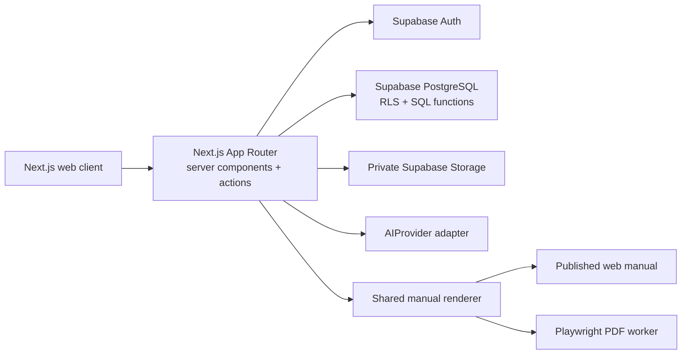
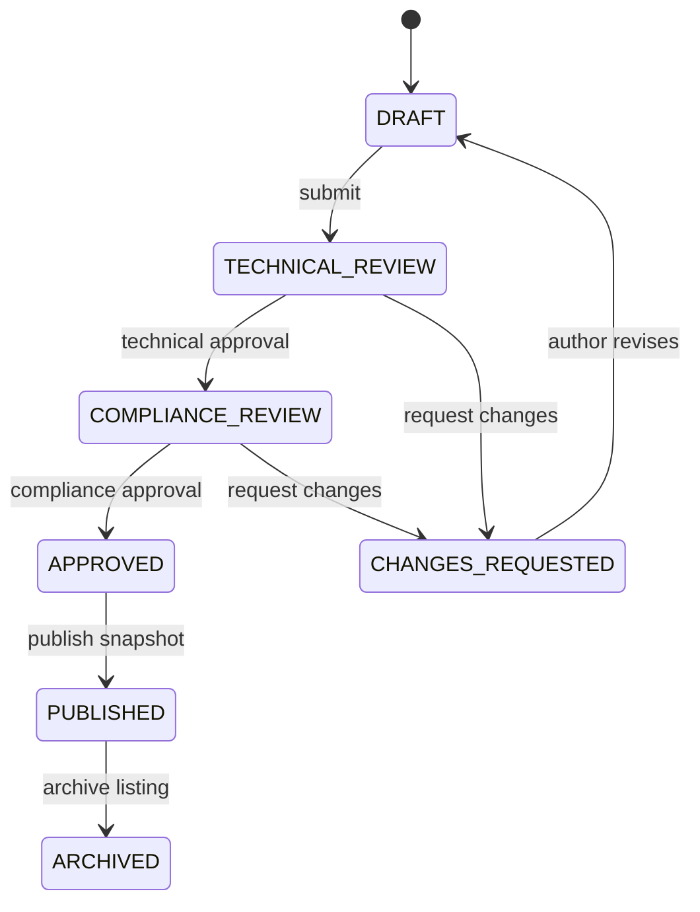

# Application architecture

## Decision summary

Smartin Manual Builder will be a single Next.js application backed by Supabase. A modular monolith is the right first architecture: the product has one team, one data model, and workflows that need transactions and shared authorization. Separate services would add deployment and consistency costs without Phase 1–7 value.



## Runtime boundaries

- **Browser:** interactive forms, builder panels, client-side draft status, editor and accessible reordering controls. It never decides authorization.
- **Next.js server:** session validation, authorization policies, mutations, publish transitions, signed asset URLs, AI request constraints, and PDF orchestration.
- **PostgreSQL:** normalized records, status constraints, version uniqueness, audit metadata, and row-level security as defense in depth.
- **Storage:** private buckets for draft assets. Published assets are served only through controlled signed URLs or copied to a publish-safe path during the publish transaction.
- **AI provider:** accepts a fact context and requested transformation. A mock provider is the default when no credential exists. Output is always a proposed revision.
- **Renderer:** one typed manual view model feeds editor preview, public web output, print CSS, and PDF. There is no second PDF content model.

## Proposed folder structure

The structure is intentionally feature-oriented. Route-specific UI stays near its route; cross-feature primitives stay shared.

```text
smartin-manual-builder/
├── app/
│   ├── (auth)/login/
│   ├── (workspace)/
│   │   ├── dashboard/
│   │   ├── ea-products/
│   │   ├── manuals/
│   │   │   ├── new/
│   │   │   └── [manualId]/
│   │   │       ├── edit/
│   │   │       ├── preview/
│   │   │       └── reviews/
│   │   ├── templates/
│   │   ├── reviews/
│   │   ├── resources/
│   │   └── settings/
│   ├── manual/[eaSlug]/[version]/
│   ├── api/health/
│   ├── error.tsx
│   ├── loading.tsx
│   └── layout.tsx
├── features/
│   ├── ai/
│   ├── ea-products/
│   ├── manuals/
│   ├── parameters/
│   ├── publishing/
│   ├── reviews/
│   └── validation/
├── components/
│   ├── ui/
│   ├── app-shell/
│   └── manual-renderer/
├── lib/
│   ├── auth/
│   ├── supabase/
│   ├── permissions/
│   ├── env.ts
│   └── utils.ts
├── supabase/
│   ├── migrations/
│   ├── policies/
│   └── seed.sql
├── tests/
│   ├── e2e/
│   └── fixtures/
├── public/brand/
├── docs/
└── design-system/
```

## Data flow and source of truth

1. EA identity, requirements, support contacts, parameters, and dependencies are recorded once as structured entities.
2. Manual sections reference reusable structured data rather than copying it into opaque rich text.
3. Blocks store a discriminated `type` plus validated JSON payload. Domain-heavy items such as parameters and image assets use normalized records and are referenced by ID.
4. A `ManualViewModel` query assembles structured data, section ordering, blocks, and assets for both editable preview and publishing.
5. Publication creates an immutable snapshot and records its content hash. A newer draft is a distinct manual version.

## Authorization model

Roles are organization-scoped: `ADMIN`, `DEVELOPER`, `TECHNICAL_REVIEWER`, and `COMPLIANCE_REVIEWER`. Permission checks use actions (`manual:update`, `review:technical`, `manual:publish`) rather than scattered role comparisons.

- Developers can update drafts they own or are assigned to.
- Technical reviewers can comment and make technical-review decisions but cannot self-approve their own work.
- Compliance reviewers act only after technical approval.
- Admins manage templates, assignments, and publishing, with all privileged actions audited.
- Public routes read only immutable `PUBLISHED` snapshots.
- RLS mirrors the server policy. The service key is restricted to trusted server jobs and never enters the browser bundle.

## Workflow invariants



Transitions are server-side commands with preconditions. A published record cannot be edited or overwritten; “Create manual for new version” clones it into a new draft.

## Editor architecture

TipTap is deferred until Phase 3. Its extension model supports custom nodes and custom node views, so it fits callouts, images, FAQs, parameter references, and future collaboration. In Phase 1, the editor area uses static mock blocks so the product layout and navigation can be validated before editor complexity is introduced.

Block payloads are validated per type at every write boundary. Stored editor JSON is rendered through an allowlisted renderer; arbitrary HTML is neither trusted nor directly injected.

## AI architecture

```ts
interface AIProvider {
  improveText(input: GroundedRequest): Promise<RevisionProposal>
  simplifyText(input: GroundedRequest): Promise<RevisionProposal>
  technicalRewrite(input: GroundedRequest): Promise<RevisionProposal>
  generateSteps(input: GroundedRequest): Promise<RevisionProposal>
  generateCaption(input: GroundedRequest): Promise<RevisionProposal>
  detectClaims(input: GroundedRequest): Promise<ClaimFinding[]>
}
```

`GroundedRequest` contains selected text, a permitted fact bundle, locale, and operation—not unrestricted database context. The provider returns either a proposal with fact references or `ADDITIONAL_INFORMATION_REQUIRED`. The UI never auto-applies a response.

## Publishing and PDF

The manual renderer produces semantic HTML and print styles. The public route uses that renderer directly. A server-side Playwright job loads a signed print route, waits for fonts/images, and exports A4. Long tables repeat headers; blocks declare page-break preferences; captions remain grouped with images when possible.

## Observability and failure handling

- Structured server logs use request IDs but exclude manual contents, tokens, source code, and signed asset URLs.
- Mutations return typed field or workflow errors.
- PDF and AI operations are idempotent jobs with visible retry states.
- Publish uses a database transaction so snapshot, version state, and audit entry cannot diverge.
- Health checks cover the application; readiness additionally verifies required configuration.

## Major technical decisions

| Decision | Rationale | Revisit when |
|---|---|---|
| Next.js modular monolith | One deployable, shared types, server rendering, fewer moving parts | Independent teams or workload isolation justify services |
| Supabase without Prisma initially | Supabase client + SQL migrations/RLS avoid a second schema abstraction | Complex cross-database portability or ORM-only tooling becomes necessary |
| Feature folders + route colocation | Keeps business logic out of components while preserving App Router conventions | Never by default; change only if ownership boundaries change |
| TipTap in Phase 3 | Extensible custom nodes and future collaboration | A prototype proves serialization or accessibility requirements cannot be met |
| One renderer for web/preview/PDF | Prevents content and styling drift | Never; output-specific wrappers may differ, content model may not |
| Mock roles/data in Phase 1 | Validates information architecture quickly without fake security | Replaced by real auth/data in Phase 2 |
| No queue in MVP | PDF/AI volume is unknown | Execution limits or throughput measurements require a queue |
