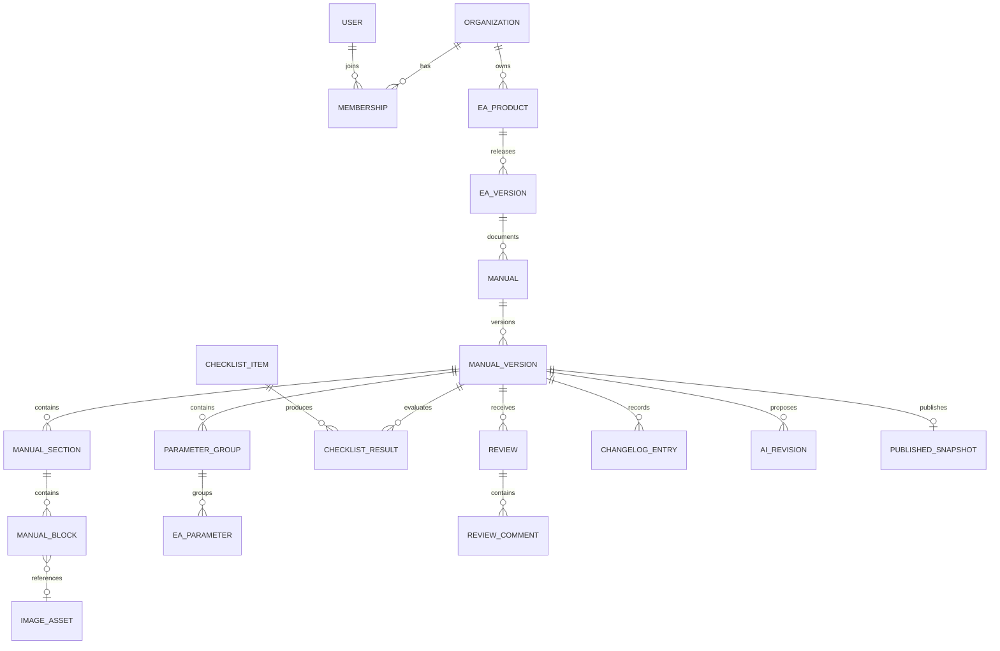

# Data model proposal

## Model overview



## Core records

| Entity | Key fields and constraints |
|---|---|
| `organizations` | `id`, `name`, `slug` unique, timestamps |
| `users` | `id` matching auth user, display name, email; no application role stored globally |
| `memberships` | organization + user unique, role enum, active flag |
| `ea_products` | organization, owner, name, slug unique per organization, description, archived timestamp |
| `ea_versions` | product, semantic version string, platform `MT4/MT5`, release date, structured requirements, support details; version unique per product/platform |
| `manuals` | stable documentation lineage linked to product; template origin and locale |
| `manual_versions` | manual, EA version, manual version, status, completion snapshot, created/updated/published/reviewed metadata; version unique per manual |
| `manual_sections` | manual version, stable section key, title, required flag, custom flag, position, completion state |
| `manual_blocks` | section, block type, validated JSON payload, position, optional image/parameter reference; soft-delete metadata for recovery |
| `image_assets` | organization, owner, private storage key, MIME, dimensions, caption, alt text, annotations JSON, scan status |
| `parameter_groups` | manual version, name, position |
| `ea_parameters` | group, display/technical names, type, default/unit/range/options, description, order effects, mutability, notes, required flag, position |
| `checklist_items` | versioned template item, category, required flag, evaluation rule key |
| `checklist_results` | manual version + item unique, `PASS/WARNING/MISSING/NOT_APPLICABLE`, evidence, evaluator, reviewed timestamp |
| `reviews` | manual version, review type, reviewer, decision, summary, timestamps |
| `review_comments` | review, optional section/block target, body, resolved metadata |
| `changelog_entries` | manual version, order, change text, source EA version |
| `ai_revisions` | actor, operation, input hash, grounded fact IDs, proposed output, provider metadata, accepted/rejected timestamp; raw credentials never stored |
| `published_snapshots` | manual version unique, immutable render JSON, content hash, public slug/version, published timestamp |
| `audit_events` | organization, actor, action, entity type/id, safe metadata, timestamp; append only |

## JSON boundaries

JSON is appropriate for heterogeneous block payloads, screenshot annotations, broker requirements, and AI provider metadata. It is not used for searchable ownership, versions, parameters, reviews, or checklist states. Each JSON payload has an application schema version and Zod validation.

Example block union:

```ts
type ManualBlock =
  | { type: "text"; schemaVersion: 1; content: RichTextDocument }
  | { type: "steps"; schemaVersion: 1; steps: Step[] }
  | { type: "image"; schemaVersion: 1; imageAssetId: string; caption?: string }
  | { type: "callout"; schemaVersion: 1; tone: "warning" | "info" | "tip"; content: RichTextDocument }
  | { type: "parameterTable"; schemaVersion: 1; groupIds: string[] }
  | { type: "faq"; schemaVersion: 1; question: string; answer: RichTextDocument };
```

## Database-enforced invariants

- Required template sections cannot be deleted; only application-owned SQL functions can clone or instantiate them.
- Positions are non-negative and unique within their parent after reorder transactions.
- Review type and permitted decisions must match the current status transition.
- One active technical/compliance decision per review round.
- `published_at` and snapshot are required for `PUBLISHED`.
- Published manual versions are rejected by update/delete triggers except controlled archive metadata.
- All organization-owned tables carry `organization_id` where needed for simple, auditable RLS.

## Index plan

- Unique: product slug per organization, EA version per product/platform, manual version per manual, public slug/version.
- B-tree: manual status + updated time, assignee + status, section/block parent + position, unresolved review comments.
- Full-text search is deferred until web publishing; start with PostgreSQL generated `tsvector` over published snapshot content.

## Seed strategy

Phase 2 seeds a clearly labeled demo organization and **VMax EA** for MT5 version `1.0.0`, symbol `XAUUSD`. Technical text is marked `SAMPLE / DEMO`; no performance, win-rate, drawdown, approval, or profitability claims are fabricated.
