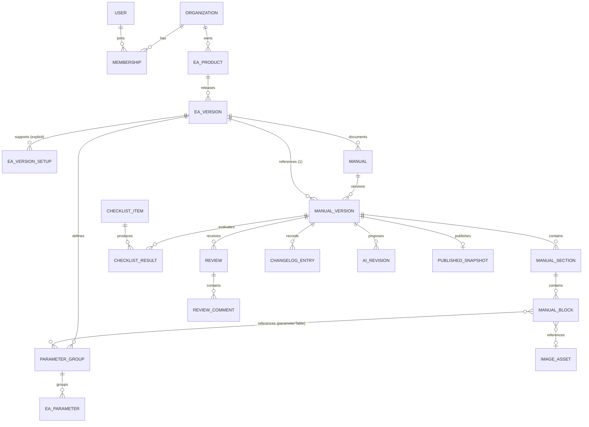

# Data model proposal

## Model overview



## Core records

| Entity | Key fields and constraints |
|---|---|
| `organizations` | `id`, `name`, `slug` unique, timestamps |
| `users` | `id` matching auth user, display name, email; no application role stored globally |
| `memberships` | organization + user unique, role enum, active flag |
| `ea_products` | organization, owner, name, slug unique per organization, description, archived timestamp |
| `ea_versions` | product, semantic version string, platform `MT4/MT5`, release date, structured requirements, support details; version unique per product/platform. **Requirements JSON does not carry a single global "minimum lot"** — see `ea_version_setups.tested_minimum_lot` and the broker-symbol-spec note below. |
| `ea_version_setups` | **ea version**, `symbol` (raw MetaTrader symbol string, broker suffixes allowed, e.g. `XAUUSD`, `XAUUSD.m`, `EURUSD.pro`), `timeframe` (controlled MT enum: `M1,M5,M15,M30,H1,H4,D1,W1,MN1`), optional `preset_ref` (preset name / reference), optional `tested_minimum_lot` (developer test data, not a broker rule), optional `notes`, `is_supported` flag, `position`; **unique `(ea_version_id, symbol, timeframe)`**. Each supported configuration is an explicit stored row — the system never infers a `symbol`×`timeframe` combination from independently listed values. |
| `manuals` | stable documentation lineage linked to product; template origin and locale |
| `manual_versions` | manual, **EA version (exactly one FK)**, manual version, status, completion snapshot, created/updated/published/reviewed metadata; version unique per manual. Does **not** own parameter definitions — it reads them from its linked `ea_versions`. |
| `manual_sections` | manual version, stable section key, title, required flag, custom flag, position, completion state |
| `manual_blocks` | section, block type, validated JSON payload, position, optional image reference, optional `parameter_group` reference(s) (a `parameterTable` block points at `parameter_groups` belonging to the manual version's linked EA version); soft-delete metadata for recovery |
| `image_assets` | organization, owner, private storage key, MIME, dimensions, caption, alt text, annotations JSON, scan status |
| `parameter_groups` | **ea version**, name, position; unique `(ea_version_id, name)`. Owned by the EA build, not by any manual. |
| `ea_parameters` | group (→ `ea_versions` transitively), display/technical names, type, default/unit/range/options, description, order effects, mutability, notes, required flag, position. These are facts about the compiled EA and are shared by every manual version documenting that EA version. |
| `checklist_items` | versioned template item, category, required flag, evaluation rule key |
| `checklist_results` | manual version + item unique, `PASS/WARNING/MISSING/NOT_APPLICABLE`, evidence, evaluator, reviewed timestamp |
| `reviews` | manual version, review type, reviewer, decision, summary, timestamps |
| `review_comments` | review, optional section/block target, body, resolved metadata |
| `changelog_entries` | manual version, order, change text, source EA version |
| `ai_revisions` | actor, operation, input hash, grounded fact IDs, proposed output, provider metadata, accepted/rejected timestamp; raw credentials never stored |
| `published_snapshots` | manual version unique, immutable render JSON, content hash, public slug/version, published timestamp |
| `audit_events` | organization, actor, action, entity type/id, safe metadata, timestamp; append only |

## Ownership: EA build facts vs. manual content

Two ownership trees, kept strictly separate:

```text
EAProduct
  └─ EAVersion
       ├─ EAParameterGroup   (parameter_groups)
       │    └─ EAParameter    (ea_parameters)
       └─ EAVersionSetup      (ea_version_setups)   ← explicit supported symbol/timeframe configurations

Manual
  └─ ManualVersion            (→ exactly one EAVersion)
       └─ ManualSection
            └─ ManualBlock    (a parameterTable block references EAParameterGroup(s) of the linked EAVersion)
```

- **Technical parameter definitions belong to `EAVersion`.** Technical name, type, default value, unit, range, enum options, description, and operational effect are facts about the compiled EA build. They are not copied into a manual version. Two manual versions documenting the **same** EA version (e.g. Manual Version `1.0.0` and `1.0.1` for EA Version `1.0.0`) read the **same** parameter definitions — they cannot silently diverge.
- **Supported symbol/timeframe configurations belong to `EAVersion`** as `ea_version_setups` rows. A configuration is a first-class record with `symbol`, `timeframe`, optional `preset_ref`, optional `tested_minimum_lot`, optional `notes`, `is_supported`, and `position`. Listing `EURUSD` and `M15` elsewhere never implies `EURUSD @ M15` is supported — only an explicit row does.
- **`symbol` stores the raw MetaTrader symbol**, including broker suffixes (`XAUUSD`, `XAUUSD.m`, `EURUSD.pro`). `timeframe` uses controlled MetaTrader values (`M1 … MN1`).
- **Minimum lot.** There is no single EA-controlled minimum lot. `ea_version_setups.tested_minimum_lot` records the smallest volume the developer actually tested for that configuration. The manual and UI must state: *"The actual minimum lot is determined by the broker's symbol specification."* Broker/account volume constraints may be documented separately in the manual (Chapter 2) but must not be presented as, or conflict with, the tested-minimum-lot value.
- **Cloning a manual version** (new-version flow) copies sections, blocks, checklist scaffold, and changelog — **not** parameter groups or setups. The clone's `parameterTable` blocks continue to reference the linked EA version's groups.

## JSON boundaries

JSON is appropriate for heterogeneous block payloads, screenshot annotations, broker requirements, and AI provider metadata. It is not used for searchable ownership, versions, parameters, reviews, or checklist states. Each JSON payload has an application schema version and Zod validation.

Example block union:

```ts
type ManualBlock =
  | { type: "text"; schemaVersion: 1; content: RichTextDocument }
  | { type: "steps"; schemaVersion: 1; steps: Step[] }
  | { type: "image"; schemaVersion: 1; imageAssetId: string; caption?: string }
  | { type: "callout"; schemaVersion: 1; tone: "warning" | "info" | "tip"; content: RichTextDocument }
  | { type: "parameterTable"; schemaVersion: 1; groupIds: string[] } // groupIds resolve against the manual version's linked EA version
  | { type: "faq"; schemaVersion: 1; question: string; answer: RichTextDocument };
```

## Database-enforced invariants

- Required template sections cannot be deleted; only application-owned SQL functions can clone or instantiate them.
- `parameter_groups` and `ea_version_setups` reference `ea_versions`, never `manual_versions`. A `parameterTable` block may only reference `parameter_groups` belonging to its manual version's linked EA version.
- `ea_version_setups` is unique on `(ea_version_id, symbol, timeframe)`; `timeframe` is constrained to the MetaTrader enum; `tested_minimum_lot` is nullable and independent of any broker rule.
- Positions are non-negative and unique within their parent after reorder transactions.
- Review type and permitted decisions must match the current status transition.
- One active technical/compliance decision per review round.
- `published_at` and snapshot are required for `PUBLISHED`.
- Published manual versions are rejected by update/delete triggers except controlled archive metadata.
- All organization-owned tables carry `organization_id` where needed for simple, auditable RLS.

## Index plan

- Unique: product slug per organization, EA version per product/platform, manual version per manual, public slug/version, parameter group per EA version, `ea_version_setups` per `(ea_version, symbol, timeframe)`.
- B-tree: manual status + updated time, assignee + status, section/block parent + position, `parameter_groups`/`ea_version_setups` by `ea_version_id` + position, unresolved review comments.
- Full-text search is deferred until web publishing; start with PostgreSQL generated `tsvector` over published snapshot content.

## Seed strategy

Phase 2 seeds a clearly labeled demo organization and **VMax EA** for MT5 version `1.0.0`. The seed includes explicit `ea_version_setups` rows — at minimum `XAUUSD @ M15` and `XAUUSD @ H1` — plus a small `parameter_groups`/`ea_parameters` set owned by that EA version. Technical text is marked `SAMPLE / DEMO`; no performance, win-rate, drawdown, approval, or profitability claims are fabricated. Any `tested_minimum_lot` in the seed is labeled as developer test data, not a broker minimum.
