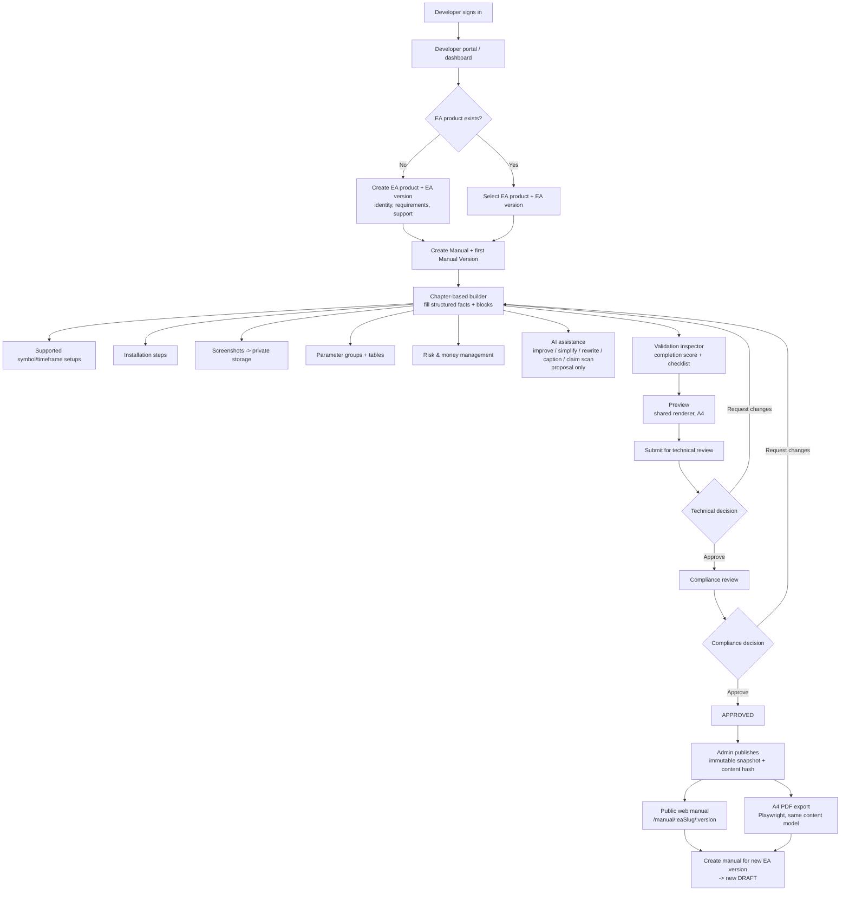

# Product Requirements Document — Smartin Manual Builder

> **Status:** Living document. Written after Phase 1 (UI foundation) completion, before Phase 2.
> **Baseline:** This PRD describes the product already established by `docs/ARCHITECTURE.md`, `docs/DATA_MODEL.md`, `docs/ROUTES_AND_COMPONENTS.md`, and delivered in mocked form in Phase 1 (`docs/PHASE_1.md`). It does **not** redesign the product and does **not** introduce a form-only MVP. Where the requirement is genuinely ambiguous it is recorded under [Open questions](#open-questions) rather than resolved by fiat.
> **Reference inputs:** `Panduan_Manual_Book_EA_Kontributor.pdf` (contributor guide + Perba Bappebti 12/2022 summary) and `User Manual SAS SMARTBOT 2024 update.pdf` (a real Smartin EA manual) are treated as domain references only.

---

## 1. Product name

**Smartin Manual Builder** — the Manual Book Builder module of **PT Smartin Advisor Sistem's EA Developer Tools** product.

## 2. Product vision

Every MetaTrader 4/5 Expert Advisor that PT Smartin Advisor Sistem advises with should ship with a manual book that a non-technical trader, a Market/technical reviewer, and a compliance reviewer can all rely on — produced from structured EA facts, versioned alongside the EA, reviewed by the right people in the right order, and published as an immutable web + PDF document. The tool exists so that writing the manual is a guided, reviewable engineering activity instead of a last-minute marketing attachment.

## 3. Problem statement

Good EAs fail in the field because their manuals are unclear: users do not know the supported symbols, how to install the `.ex4`/`.ex5` file, what an input does, or when the EA may be stopped. The consequences are poor Market reviews, repeated support tickets, and developers re-explaining the same thing. Free-form documents also drift from the compiled EA, mix marketing claims into instructions, and are impossible to audit against Peraturan Bappebti Nomor 12 Tahun 2022, which names the manual book explicitly as a required document.

Smartin needs a system that:

1. captures EA identity, requirements, parameters, dependencies, and support contacts **once** as structured data;
2. drives every manual chapter from that structured data instead of opaque rich text;
3. runs an automated **documentation-readiness** checklist (never a regulatory approval);
4. routes drafts through technical review then compliance review with an auditable history;
5. produces one immutable published artefact rendered identically to web and A4 PDF.

## 4. Background

- PT Smartin Advisor Sistem is a licensed Penasihat Berjangka (futures adviser). Its EAs are offered as *Nasihat Berbasis Teknologi Informasi* under Perba Bappebti 12/2022 and Perba 6/2020.
- The existing SAS SMARTBOT manual shows the domain shape the builder must accommodate: indicators (MA/SMA/EMA, RSI, Engulfing), notification channels, trade modes (single entry, stop grid, limit grid, stop+limit grid), lot mode (fixed / compound), multi-order, SL/TP/trailing, level order / lot multiply / distance, TP-USD / SL-USD, magic number, comment order, plus a terms-and-conditions section and a support contact block.
- The contributor guide fixes a mandatory chapter structure, a source-of-truth hierarchy ("if the manual contradicts the code, the manual is wrong"), an input-table column set, style rules (Bahasa Indonesia, imperative steps, server time, no overclaiming), and a 26-item pre-publication checklist.
- Engineering has completed Phase 0 (architecture) and Phase 1 (mocked UI). Phases 2–8 are planned in `docs/IMPLEMENTATION_PLAN.md` and are **not** superseded by this PRD.

## 5. Target users

| User | Context | Primary outcome they want |
|---|---|---|
| **EA developer / documentation contributor** | Writes or maintains the EA and its manual; works from compiled MQL inputs and `.set` presets. | Turn structured EA facts into a complete, reviewable manual without starting from a blank page and without inventing facts. |
| **Technical reviewer** | Verifies the manual matches the EA's real behaviour on a demo chart. | Confirm every input, limit, and step is accurate; request changes with precise anchors. |
| **Compliance reviewer** | Checks documentation completeness and claim language against Perba 12/2022 expectations. | Confirm required information exists and no prohibited claims remain, then mark it ready. |
| **Workspace admin** | Manages the organisation, memberships, templates, checklist templates, assignments, and publishing. | Keep the workspace consistent and auditable; control who can publish. |
| *(Read-only, Phase 7+)* **Public reader** | Trader, support agent, or Market reviewer reading a published manual. | Read an immutable, versioned manual on the web or as PDF. |

## 6. User roles

Roles are **organisation-scoped** membership roles (`memberships.role`), not global user attributes. Authorisation is checked by **action** (e.g. `manual:update`, `review:technical`, `manual:publish`), never by scattered role comparisons. RLS mirrors the server policy as defence in depth.

| Role | Can | Cannot |
|---|---|---|
| **DEVELOPER** | Create EA products/versions; create manuals and manual versions; edit drafts they own or are assigned to; edit structured facts, sections, blocks, parameters; upload private images; run validation; view previews; submit for technical review; read templates. | Perform technical or compliance review decisions; publish; edit another org's data; edit a manual version once it leaves `DRAFT`/`CHANGES_REQUESTED` except by resubmitting. |
| **TECHNICAL_REVIEWER** | See the technical review queue; open assigned manuals in read/comment mode; add block/chapter/general comments; make the technical decision (approve → compliance, or request changes). | Approve their own authored/edited manual (no self-approval); make compliance decisions; publish; edit manual content directly. |
| **COMPLIANCE_REVIEWER** | See the compliance queue **after technical approval**; comment; make the compliance decision (approve, or request changes). | Act before technical approval; edit manual content; publish unless also granted `manual:publish`; approve their own authored manual. |
| **ADMIN** | Everything above within the org, plus: manage memberships and role assignments, manage manual/checklist templates, assign reviewers, and publish approved manuals. All privileged actions are audited. | Act outside their organisation; bypass the workflow state machine; edit or overwrite a `PUBLISHED` snapshot. |

Assignment note: a user may hold more than one role in an org; the self-approval prohibition is enforced on the **actor vs. author** relationship, not merely on role.

## 7. User needs

**Developer**
- Start every chapter from a Smartin template, not a blank page.
- Enter each fact (input name, default, unit, supported symbol/timeframe) exactly once and reuse it across chapters.
- Represent *multiple explicit* supported symbol/timeframe configurations for one EA version (e.g. `XAUUSD / M15`, `XAUUSD / H1`, `EURUSD / H1`) as structured rows entered through a functional Supported Configuration editor — never a free-text blob, and never inferred (`EURUSD / M15` is not "supported" just because `EURUSD` and `M15` each appear somewhere).
- Build installation steps as discrete, ordered actions with menu locations.
- Attach screenshots to a step or figure with alt text and a caption; keep them private until publication.
- Document parameters in grouped tables with terminal name, technical name, type, default, unit, safe range, effect, and when-changeable.
- Document risk and money-management behaviour, with prominent warnings for grid/martingale/recovery modes.
- Ask AI to improve, simplify, or technically rewrite *supplied* text, generate step drafts or captions from supplied facts, and scan for risky claims — and always see a before/after proposal, never an automatic overwrite.
- See a completion score and a list of what is missing before submitting.
- Preview the manual exactly as it will publish (web and A4).
- Submit for review and see reviewer comments resolved in place.

**Technical reviewer**
- A queue of manuals submitted for technical review with completion and checklist context.
- Read mode with the same renderer the developer sees, plus comment threads anchored to chapters/blocks.
- One clear decision: approve (advance to compliance) or request changes (return to developer) with a summary.

**Compliance reviewer**
- A queue containing only manuals that passed technical review.
- The documentation checklist results (PASS / WARNING / MISSING / NOT_APPLICABLE) with evidence links.
- Claim-scan findings surfaced for judgement.
- One decision: approve or request changes; UI wording is "ready for compliance review" / "documentation checklist completed", never "regulator approved".

**Admin**
- Manage members, roles, reviewer assignments.
- Maintain versioned manual and checklist templates.
- Publish an approved manual: create the immutable snapshot + content hash + public slug/version in one transaction.
- Read the audit trail.

## 8. Product goals

1. **G1 — Structured source of truth.** EA facts are stored as normalised entities and referenced by manual chapters; the manual can never silently diverge from them.
2. **G2 — Guided completeness.** Every manual is built from a required chapter structure with per-chapter completion state and a workspace-level score.
3. **G3 — Grounded AI.** AI can rewrite supplied facts and detect claims but cannot invent facts or performance numbers; every AI output is a reviewable proposal.
4. **G4 — Documentation-readiness assistance.** A versioned checklist reports readiness for human review, explicitly distinct from regulatory approval.
5. **G5 — Ordered, auditable review.** Technical review precedes compliance review; decisions, comments, and transitions are recorded; no self-approval.
6. **G6 — Immutable, single-model output.** One `ManualViewModel` renders editor preview, public web, print CSS, and PDF; publication is an immutable snapshot with a content hash; a newer draft is a distinct version.
7. **G7 — Organisation isolation.** All owned data carries `organization_id`; server action checks and RLS both enforce it.
8. **G8 — Phase discipline.** The product is delivered along the committed Phase 0–8 roadmap; phase boundaries require explicit approval.

## 9. Non-goals

- **Not** a regulatory approval system. It never asserts Bappebti/Bursa approval; it produces documentation and a readiness signal.
- **Not** an MQL coding tool, backtester, VPS manager, or trade terminal.
- **Not** a general CMS or website builder; output is the EA manual only.
- **Not** a marketing-copy generator; it actively discourages profit/win-rate language.
- **Not** a real-time collaboration/multiplayer editor in the MVP (TipTap is chosen partly to keep that option open for later).
- **Not** a multi-tenant billing/subscription platform.
- **Not** a replacement for the official Bappebti disclosure-statement form or the client onboarding process; it references them.
- **Not** a translation platform; ID and EN manuals are separate documents, not mixed per sentence.
- **Not** a form-only "fill fields → get PDF" MVP. The chapter-based builder, block model, review workflow, and versioning are core.

## 10. Core value proposition

> Smartin Manual Builder turns EA documentation from a risky free-text afterthought into a structured, grounded, reviewable engineering artefact: enter the EA's facts once, build every required chapter from a template, let AI polish (never invent) the prose, see exactly what is still missing, route it through technical then compliance review, and publish one immutable manual to web and PDF from a single content model.

## 11. Main user journey

## 12. Functional requirements

IDs are referenced by `docs/REQUIREMENTS_TRACEABILITY.md`. "Phase" is the phase in which the requirement becomes real (Phase 1 = mocked UI only).

### 12.1 EA products and versions (`PRD-EA-*`)

| ID | Requirement | Phase |
|---|---|---|
| PRD-EA-001 | A developer/admin can create an **EA Product** with organisation, owner, name, unique slug per organisation, and description. | 2 |
| PRD-EA-002 | A developer/admin can archive an EA Product (soft, timestamped); archived products are hidden from default lists but remain addressable. | 2 |
| PRD-EA-003 | An EA Product has one or more **EA Versions**, each with a semantic version string, platform (`MT4` or `MT5`), release date, structured requirements, and support details. | 2 |
| PRD-EA-004 | EA Version is unique per product **and platform** (an MT4 and MT5 1.0.0 may coexist). | 2 |
| PRD-EA-005 | EA Version requirements capture: account type, testing deposit, broker requirements, VPS need (Yes/No/Recommended), DLL required (Yes/No), WebRequest required (Yes/No), custom indicator dependencies, and (optionally) broker/account volume constraints. Supported symbols and timeframes are **not** stored here as free text — they live in the Supported Configuration model (`PRD-EA-009`). There is **no single EA-controlled "minimum lot"** field; per-configuration developer test data is captured as *Tested Minimum Lot* (`PRD-EA-010`). | 2 |
| PRD-EA-006 | An EA Version declares **multiple explicit supported symbol/timeframe configurations**, each an addressable record, not one free-text field, and never inferred from independently listed values. | 2 (persistent model **and** functional input UI) |
| PRD-EA-007 | Creating a new EA Version from an existing product pre-fills nothing that is EA-version-specific unless the user explicitly copies from a prior version. | 2 |
| PRD-EA-008 | `/ea-products` lists the org's EA Products; `/ea-products/[productId]` shows identity and its versions. | 1 (list, static) / 2 (real + detail route) |
| PRD-EA-009 | The **Supported Configuration** model (`ea_version_setups`) belongs to EA Version. Each configuration has, at minimum: `symbol` (raw MetaTrader symbol, broker suffixes allowed — `XAUUSD`, `XAUUSD.m`, `EURUSD.pro`), `timeframe` (controlled MetaTrader value — `M1,M5,M15,M30,H1,H4,D1,W1,MN1`), optional preset name/reference, optional Tested Minimum Lot, optional notes, a supported/enabled flag, and a position/order. `(ea_version, symbol, timeframe)` is unique. The **input UI** for adding, editing, reordering, enabling/disabling, and removing configurations ships in **Phase 2**; Phase 3 may only improve its presentation. The system must never infer an unlisted `symbol`×`timeframe` combination. | 2 |
| PRD-EA-010 | **Tested Minimum Lot** is developer testing data attached to a Supported Configuration (or, where not configuration-specific, to the EA Version). It is presented as *"tested minimum lot"*, never as "the minimum lot". Every surface that shows it also states: *"The actual minimum lot is determined by the broker's symbol specification."* Broker/account volume constraints may be documented separately (Chapter 2) but must not conflict with the tested value. | 2 |

### 12.2 Manuals and manual versions (`PRD-MAN-*`)

| ID | Requirement | Phase |
|---|---|---|
| PRD-MAN-001 | A **Manual** is a stable documentation lineage linked to one EA Product, with template origin and locale. | 2 |
| PRD-MAN-002 | A Manual has one or more **Manual Versions**, each linked to a specific EA Version, with its own manual version string, status, completion snapshot, and lifecycle timestamps. | 2 |
| PRD-MAN-003 | Manual version string is unique per Manual. | 2 |
| PRD-MAN-004 | The create-manual wizard captures the reusable EA facts (identity, requirements, support) and creates the Manual + first Manual Version seeded from the active template. | 1 (mock) / 2 (real) |
| PRD-MAN-005 | The wizard supports "use existing EA" and "create new EA" paths and never silently discards entered data on back/cancel. | 1 (mock) / 2 (real persistence) |
| PRD-MAN-006 | A Manual Version instantiates the canonical chapter structure (see `docs/CONTENT_REQUIREMENTS.md`): sections have a stable key, title, required flag, custom flag, position, and completion state. | 1 (mock chapters) / 2 (persisted) |
| PRD-MAN-007 | Required template sections cannot be deleted; only application-owned SQL functions clone/instantiate them. | 2 |
| PRD-MAN-008 | A developer can add a **custom chapter** (non-required) and reorder chapters with drag **and** keyboard/button alternatives. | 3 |
| PRD-MAN-009 | Each chapter contains ordered **blocks** with a discriminated `type` and validated JSON payload: `text`, `steps`, `image`, `callout`, `parameterTable`, `faq`. | 1 (mock render) / 3 (editable) |
| PRD-MAN-010 | Block positions are non-negative and unique within a chapter after any reorder transaction. | 2 (constraint) / 3 (UI) |
| PRD-MAN-011 | Deleting a block is recoverable (soft-delete metadata). | 2 / 3 |
| PRD-MAN-012 | Draft edits autosave with debounce and conflict handling (last-writer detection, not silent overwrite). | 2 |
| PRD-MAN-013 | "Create manual for new version" clones an existing manual version's sections, blocks, checklist scaffold, and changelog into a fresh `DRAFT` linked to the chosen EA Version; it never edits the published one and never copies EA parameter definitions or Supported Configurations (those stay owned by the EA Version and are referenced). | 6 |
| PRD-MAN-014 | The builder always renders the manual identified by the route param; creating "Polaris EA" must never display "VMax EA" data. | 2 |

### 12.3 Structured content: setups, installation, screenshots, parameters, risk (`PRD-CNT-*`)

| ID | Requirement | Phase |
|---|---|---|
| PRD-CNT-001 | Supported Configurations (`PRD-EA-009`) are edited as structured rows (`symbol`, `timeframe`, optional preset ref, optional Tested Minimum Lot, optional notes, supported flag, order) and rendered into Chapter 2 and Chapter 9 as explicit rows. Model and editor both ship in Phase 2. | 2 |
| PRD-CNT-002 | Installation is authored as an ordered **step list**; each step has a title, instruction, and optional menu path and image reference. | 1 (mock) / 3 (builder) |
| PRD-CNT-003 | A developer can **upload an image** to private Supabase Storage; it is stored as an `image_assets` record with MIME, dimensions, caption, alt text, annotations JSON, and scan status. | 2 |
| PRD-CNT-004 | Images are never public while a manual is unpublished; the app serves them via short-lived signed URLs. On publish they are copied to a publish-safe path or served through controlled signed URLs. | 2 (private) / 7 (publish path) |
| PRD-CNT-005 | An `image` block references an `image_assets` id and carries an optional caption; alt text is required before a chapter with an image can be marked complete. | 3 (block) / 5 (validation) |
| PRD-CNT-006 | Parameters are organised into **parameter groups** (ordered) containing **EA parameters** with: display name, technical name, type, default, unit, safe range, options, description, order effect, mutability ("before start" / "may change live" / "needs re-attach"), notes, required flag, position. **These definitions belong to the EA Version** (`PRD-CNT-010`), not to a manual version. | 2 (data + ownership) / 3 (builder UI) |
| PRD-CNT-007 | A `parameterTable` block references one or more parameter group ids **from the manual version's linked EA Version** and renders the group heading + table columns (Parameter, Type, Default, Safe range, Effect) used in Phase 1. | 1 (mock) / 3 (block) |
| PRD-CNT-010 | EA technical parameter definitions (technical name, type, default, unit, range, enum options, description, operational effect) are **owned by EA Version** — hierarchy `EAProduct → EAVersion → EAParameterGroup → EAParameter`. A Manual Version references (never copies) the parameter groups of its single linked EA Version. Two manual versions documenting the same EA Version therefore read identical parameter definitions and cannot silently diverge. Cloning a manual version does not clone parameter definitions. | 2 (ownership fixed before migrations) / 3 (builder UI) |
| PRD-CNT-008 | Units are explicit: the manual must state whether values are points or pips and reference `_Point`; validation flags mixed usage without a definition. | 5 |
| PRD-CNT-009 | Risk & money-management chapter documents the verbal lot formula, floor/step lot behaviour, and below-min-lot behaviour; dangerous modes (martingale/grid/recovery) carry a `callout` warning at the top of the chapter. | 3 (authoring) / 5 (validation) |

### 12.4 Validation and checklist (`PRD-VAL-*`)

| ID | Requirement | Phase |
|---|---|---|
| PRD-VAL-001 | The inspector shows a **completion score** = share of required chapters with sufficient content, plus a per-chapter status (complete / incomplete / issue). | 1 (mock) / 5 (engine) |
| PRD-VAL-002 | A **versioned checklist template** produces one `checklist_result` per item per manual version with state `PASS` / `WARNING` / `MISSING` / `NOT_APPLICABLE`, evidence, evaluator, and reviewed timestamp. | 5 |
| PRD-VAL-003 | Automated checks detect: missing required fields, missing parameters, EA/manual version mismatch, missing disclaimer sentence, missing 24/7 contact, risky phrases. | 5 |
| PRD-VAL-004 | All checklist and score wording is "ready for review" / "documentation checklist completed" — never "approved", "Bappebti approved", or equivalent. | 1 (copy) / 5 (engine) |
| PRD-VAL-005 | A manual cannot be submitted for technical review while any **required** chapter is `MISSING` (WARNING does not block). | 5 / 6 |

### 12.5 Reviews and workflow (`PRD-REV-*`)

| ID | Requirement | Phase |
|---|---|---|
| PRD-REV-001 | Workflow states: `DRAFT → TECHNICAL_REVIEW → COMPLIANCE_REVIEW → APPROVED → PUBLISHED`, with `CHANGES_REQUESTED` reachable from either review state and returning to `DRAFT`, and `PUBLISHED → ARCHIVED`. | 6 |
| PRD-REV-002 | Transitions are server-side commands with preconditions; the client never decides authorisation. | 6 |
| PRD-REV-003 | Admin assigns a technical reviewer and a compliance reviewer per manual version. | 6 |
| PRD-REV-004 | Reviewers add comments targeting a section, a block, or the manual generally; comments have resolved metadata. | 6 |
| PRD-REV-005 | Technical decision = approve (→ `COMPLIANCE_REVIEW`) or request changes (→ `CHANGES_REQUESTED`) with a summary. Compliance decision = approve (→ `APPROVED`) or request changes. | 6 |
| PRD-REV-006 | A reviewer cannot approve a manual version they authored or edited. | 6 |
| PRD-REV-007 | One active technical decision and one active compliance decision per review round. | 6 |
| PRD-REV-008 | After `CHANGES_REQUESTED`, the developer revises in `DRAFT` and resubmits; comment threads persist across rounds. | 6 |
| PRD-REV-009 | `/reviews/technical` and `/reviews/compliance` show role-scoped queues; `/manuals/[manualId]/reviews` shows the comment + decision history. | 1 (mock queues) / 6 (real) |

### 12.6 AI assistant (`PRD-AI-*`)

| ID | Requirement | Phase |
|---|---|---|
| PRD-AI-001 | An `AIProvider` adapter exposes `improveText`, `simplifyText`, `technicalRewrite`, `generateSteps`, `generateCaption`, `detectClaims`. | 4 |
| PRD-AI-002 | A **mock provider** is the default when no credential is configured; a configured provider is used only when `AI_PROVIDER` + `AI_API_KEY` are present. The UI makes the mock provider unmistakable. | 4 |
| PRD-AI-003 | Every request is a `GroundedRequest` = selected text + a permitted fact bundle + locale + operation. The provider never receives unrestricted database context. | 4 |
| PRD-AI-004 | The provider returns either a `RevisionProposal` (with fact references) or `ADDITIONAL_INFORMATION_REQUIRED`. The UI never auto-applies output; the developer accepts/rejects a before/after diff. | 4 |
| PRD-AI-005 | AI must not introduce facts, numbers, symbols, timeframes, or performance claims absent from the supplied fact bundle. Violations are the provider's responsibility to avoid and the claim scanner's to catch. | 4 / 5 |
| PRD-AI-006 | `detectClaims` returns `ClaimFinding[]` flagging profit guarantees, win-rate/consistency claims, "risk-free", profit-sharing, "EA trades on the client's behalf", MLM language, and "collect margin to developer account". | 4 / 5 |
| PRD-AI-007 | Every accepted/rejected AI revision is recorded in `ai_revisions` (actor, operation, input hash, grounded fact ids, proposed output, provider metadata, decision timestamp). Raw credentials are never stored. | 4 |

### 12.7 Output: web and PDF (`PRD-OUT-*`)

| ID | Requirement | Phase |
|---|---|---|
| PRD-OUT-001 | A single `ManualViewModel` query assembles structured data + section ordering + blocks + assets for editor preview, public web, print CSS, and PDF. There is no second PDF content model. | 1 (renderer) / 7 (finalised) |
| PRD-OUT-002 | Publication creates an immutable `published_snapshots` row (render JSON, content hash, public slug, public version, published timestamp), one per manual version, in a DB transaction with the version state change and an audit entry. | 6 |
| PRD-OUT-003 | `PUBLISHED` manual versions are rejected by update/delete triggers except controlled archive metadata. | 6 |
| PRD-OUT-004 | `/manual/[eaSlug]/[version]` publicly serves only a `PUBLISHED` snapshot, with table of contents, in-page search, and version navigation. | 7 |
| PRD-OUT-005 | A server-side Playwright job loads a signed print route and exports A4 PDF: repeated table headers, block page-break preferences, captions grouped with images. | 7 |
| PRD-OUT-006 | PDF/AI operations are idempotent jobs with visible retry states. | 7 |
| PRD-OUT-007 | The preview route (`/manuals/[manualId]/preview`) uses the same renderer and shows real page proportions; PDF export is disabled with an explanation until Phase 7. | 1 (mock) / 7 (enabled) |

### 12.8 Platform, auth, templates, settings (`PRD-PLT-*`)

| ID | Requirement | Phase |
|---|---|---|
| PRD-PLT-001 | Supabase Auth provides cookie-based SSR sessions; `/login` replaces the mocked role switcher with real sign-in. | 2 |
| PRD-PLT-002 | Organisation + membership + role model backs every authorisation decision. | 2 |
| PRD-PLT-003 | Environment variables are validated at startup; missing required config fails readiness. | 2 |
| PRD-PLT-004 | Admin manages versioned **manual templates** and **checklist templates** at `/templates`. | 2 (CRUD) / 5 (checklist evaluation) |
| PRD-PLT-005 | `/settings` shows profile and organisation settings backed by real data. | 2 |
| PRD-PLT-006 | `/resources/guide` and `/resources/compliance` provide static guidance; the compliance resource never claims regulator approval. | 1 |
| PRD-PLT-007 | `/dashboard` summarises portfolio status, completion, and the review queue for the signed-in member's organisation. | 1 (mock) / 2 (real) |

## 13. Non-functional requirements

| ID | Requirement |
|---|---|
| PRD-NFR-001 | **Stack fidelity.** Next.js App Router modular monolith + Supabase; server components by default; no second schema abstraction (no Prisma initially); dependencies added per `docs/DEPENDENCIES.md` phase table; the committed lockfile is the executable source of truth. |
| PRD-NFR-002 | **Performance.** Dashboard and list routes render server-side; builder interactions (chapter switch, block edit) feel immediate; autosave debounce ≤ ~1s; large parameter tables scroll within a contained region, never the page. |
| PRD-NFR-003 | **Reliability.** Publish uses a DB transaction so snapshot, version state, and audit entry cannot diverge; PDF and AI jobs are idempotent and retryable. |
| PRD-NFR-004 | **Accessibility.** WCAG 2.1 AA: 4.5:1 text contrast, visible focus rings, 44px touch targets, status conveyed by icon + text (never colour alone), keyboard alternatives for drag, `prefers-reduced-motion` respected, skip link, labelled controls, inline + summary form errors. |
| PRD-NFR-005 | **Responsive.** Verified at 375 / 768 / 1024 / 1440 px. Builder is 280 / minmax(560px,1fr) / 320 px on desktop; chapters and inspector become drawers/sheets below 1024 px; tables become card rows below 768 px; no nested horizontal scroll in the builder centre column; no document-level horizontal scroll on mobile. |
| PRD-NFR-006 | **Design system conformance.** Follows `design-system/smartin-manual-builder/MASTER.md`: token colours, IBM Plex Sans / JetBrains Mono, radius 4/6/8, motion 120–200 ms opacity/transform only, no marketing hero sections in the workspace, no large rounded marketing cards, no emoji icons (Lucide only). |
| PRD-NFR-007 | **Observability.** Structured server logs keyed by request id; logs exclude manual contents, tokens, source code, and signed URLs. Mutations return typed field/workflow errors. Health check covers the app; readiness additionally verifies config. |
| PRD-NFR-008 | **Internationalisation.** UI and manuals default to Bahasa Indonesia; platform terms stay in the terminal's language (Navigator, Inputs, Algo Trading, Strategy Tester); ID and EN manuals are separate documents. |
| PRD-NFR-009 | **Testability.** Vitest + Testing Library from Phase 2 for domain logic and interactive components; Playwright for the acceptance workflow and (Phase 7) PDF/visual regression. |
| PRD-NFR-010 | **Maintainability.** Feature-oriented folders; business logic outside components; block payloads validated with Zod at every write boundary; stored editor JSON rendered through an allowlisted renderer (no trusted/raw HTML injection). |

## 14. Security and privacy requirements

| ID | Requirement |
|---|---|
| PRD-SEC-001 | The Supabase service/secret key is server-only and never enters the browser bundle; it is used only by trusted server jobs. |
| PRD-SEC-002 | Every organisation-owned table carries `organization_id`; server action checks **and** RLS enforce tenant isolation. Cross-organisation reads/writes are impossible for non-service callers. |
| PRD-SEC-003 | Authorisation is action-based (`manual:update`, `review:technical`, `review:compliance`, `manual:publish`, `template:manage`, `member:manage`); the browser never decides authorisation. |
| PRD-SEC-004 | Draft images live in **private** buckets; access is via short-lived signed URLs; published assets are served only through controlled signed URLs or a publish-safe copy. |
| PRD-SEC-005 | Public routes read only immutable `PUBLISHED` snapshots — no draft, no private asset, no structured working data. |
| PRD-SEC-006 | AI requests carry only the permitted fact bundle + selected text + locale + operation; never raw DB context, tokens, or other tenants' data. Provider credentials are never persisted. |
| PRD-SEC-007 | `audit_events` is append-only and records actor, action, entity type/id, safe metadata, and timestamp for all privileged actions (assignment, decision, publish, template change, member change). |
| PRD-SEC-008 | Uploaded images carry a `scan_status`; a chapter with an unscanned/failed image cannot be marked complete (Phase 5 validation), and such images are not included at publish. |
| PRD-SEC-009 | Logs and error payloads never contain manual contents, source code, credentials, or signed URLs. |
| PRD-SEC-010 | Rich text is stored as structured JSON and rendered through an allowlist; arbitrary HTML from any source is neither trusted nor injected. |

## 15. Document and versioning requirements

| ID | Requirement |
|---|---|
| PRD-VER-001 | EA Version and Manual Version are distinct, separately-stringed concepts and are displayed as such everywhere (list, builder metadata, cover, preview). |
| PRD-VER-002 | A Manual Version references exactly one EA Version; `docs/CONTENT_REQUIREMENTS.md` Chapter 0/14 require them to be shown together. |
| PRD-VER-003 | Manual documentation must not describe behaviour of a different EA version than the one it references (validation: version-mismatch check). |
| PRD-VER-004 | Publication snapshots are immutable and content-hashed; re-publishing is not editing — a change requires a new Manual Version. |
| PRD-VER-005 | Every published version remains addressable at `/manual/[eaSlug]/[version]`; older versions are navigable from a newer one. |
| PRD-VER-006 | A `changelog_entries` set per Manual Version records ordered change text and the source EA version; a breaking change entry states its impact on users with open positions. |
| PRD-VER-007 | Feature/behaviour changes that reach a client require a changelog entry and (per Perba 12/2022 Pasal 8, recorded as guidance) client approval + report to Kepala Bappebti — the tool records the changelog and flags the obligation; it does not perform the regulatory filing. |
| PRD-VER-008 | Template and checklist templates are versioned; a manual version records which template version instantiated it, and which checklist template version evaluated it. |

## 16. AI requirements

Covered functionally in §12.6. Product-level principles:

- **Grounded only.** AI operates on a narrow, explicit fact bundle. No open-ended retrieval.
- **Proposal only.** No automatic write. The developer sees before/after and accepts or rejects.
- **Missing-info sentinel.** When the fact bundle is insufficient, the provider returns `ADDITIONAL_INFORMATION_REQUIRED` and the UI asks the developer for the fact rather than fabricating it.
- **Claim safety.** `detectClaims` is advisory input to the developer and the compliance reviewer; it never auto-edits.
- **Auditable.** Every proposal and its outcome is stored (`ai_revisions`), enabling later review of what AI suggested and whether it was used.
- **Deferred choice of SDK/model.** No AI SDK before Phase 4; provider requirements drive the choice (`docs/DEPENDENCIES.md`).
- **Visible availability.** Until Phase 4 the AI affordances in the builder inspector are visibly disabled with a "available in Phase 4" explanation, never silently missing.

## 17. Compliance-assistance requirements

Full detail in `docs/COMPLIANCE_REQUIREMENTS.md`. PRD-level:

| ID | Requirement |
|---|---|
| PRD-COMP-001 | The tool provides **documentation-completeness assistance**, not regulatory approval. No automated result is ever labelled "Bappebti Approved", "Approved", "Certified", or equivalent. |
| PRD-COMP-002 | Automated checks map to Perba 12/2022's four mandatory manual elements: cara kerja (how it works), cara instalasi (installation), cara setting (settings/inputs), kontak bantuan (24/7 support contact). |
| PRD-COMP-003 | The tool enforces presence of the Pasal 5 ayat (5) huruf d disclaimer sentence (EA is an automated aid only, does not guarantee profit, does not remove PBK risk) in the Disclaimer chapter — not a footnote. |
| PRD-COMP-004 | The claim scanner flags the prohibited categories in Perba 12/2022 Pasal 5 ayat (3) and the contributor guide §2.4. |
| PRD-COMP-005 | The checklist references (as items, not as filings) the disclosure-statement + recorded-video process (Pasal 9), the Rp50,000,000 minimum-margin onboarding note (Pasal 5 ayat 7), developer legality when the EA is not self-built (Pasal 5 ayat 4a / Pasal 6), and the algorithm/strategy transparency + effective-period statement (Pasal 5 ayat 4c / 5 ayat 6). |
| PRD-COMP-006 | Checklist result states are exactly `PASS`, `WARNING`, `MISSING`, `NOT_APPLICABLE`; `WARNING` never blocks submission, `MISSING` on a required item does. |
| PRD-COMP-007 | Automated checks and human review are visually and conceptually separated in the UI: the checklist panel is labelled as documentation readiness; the review decision is a separate human action with a named actor and timestamp. |
| PRD-COMP-008 | Backtest/performance information must appear with test conditions (broker, spread, model, date range); performance shown without conditions is a `WARNING`/`MISSING`, and never presented as a guarantee. |

## 18. Manual output requirements

| ID | Requirement |
|---|---|
| PRD-MOUT-001 | The canonical manual is the 18-chapter structure in `docs/CONTENT_REQUIREMENTS.md` (Cover 0 … Strategy Transparency 17), with required/optional/conditional flags. |
| PRD-MOUT-002 | Rendered output is semantic HTML: cover section with EA identity + versions + "Sample / Demo" marking for demo content; paged sections with running header (EA name + manual version) and footer (product + page number); chapter kicker + heading; blocks rendered per type. |
| PRD-MOUT-003 | Long-form text stays within a 65–75 character measure; A4 preview retains real page proportions. |
| PRD-MOUT-004 | Parameter tables render group headings and the standard columns; on small screens they scroll within a contained region. |
| PRD-MOUT-005 | Images render as `figure` + `figcaption`; captions describe what is shown (not "Figure 3"); account numbers / real balances / broker names are expected to be masked by the uploader (guidance surfaced in the screenshot workflow). |
| PRD-MOUT-006 | Callouts render with icon + label for `warning` / `info` / `tip` tones. |
| PRD-MOUT-007 | The manual states server time for all clock values and defines points vs pips. |
| PRD-MOUT-008 | No manual may contain prohibited claim language at publish; the publish action is gated on zero unresolved `MISSING` required items and (Phase 6) compliance approval. |

## 19. PDF / web output requirements

| ID | Requirement |
|---|---|
| PRD-POUT-001 | Web and PDF are produced from the same `ManualViewModel` + print CSS; content model never forks. |
| PRD-POUT-002 | Public web manual: table of contents, in-page search, version navigation, immutable content, no private assets. |
| PRD-POUT-003 | PDF: A4, repeated long-table headers, per-block page-break preference, caption+image grouping, fonts/images fully loaded before export. |
| PRD-POUT-004 | PDF file naming follows the contributor guide convention: `Manual_<EAName>_v<X.Y.Z>.pdf`. |
| PRD-POUT-005 | PDF generation runs server-side via Playwright against a signed print route; the job is idempotent with visible retry state. |
| PRD-POUT-006 | Until Phase 7, the preview route's "Export PDF" control is present but disabled with a phase explanation (no inert unexplained buttons). |

## 20. Success criteria

| ID | Metric / criterion |
|---|---|
| PRD-SUCC-001 | A new contributor can create an EA product + version, build the required chapters from the template, and reach a valid preview **without editing raw JSON or reading the codebase**. |
| PRD-SUCC-002 | For a completed manual, 100% of EA inputs present in the EA Version appear in a parameter table (no "phantom" or missing inputs) — measured by the version-parameter completeness check. |
| PRD-SUCC-003 | Zero published manuals contain prohibited claim language (claim scanner + compliance review). |
| PRD-SUCC-004 | Every published manual version has an immutable snapshot with a content hash and is reachable at its public URL; re-rendering it byte-stably reproduces the hash. |
| PRD-SUCC-005 | Web and PDF of the same version show the same chapters, blocks, and parameter values (visual regression fixtures, Phase 7). |
| PRD-SUCC-006 | No technical or compliance approval is ever recorded against the manual's own author/editor (self-approval attempts are rejected with a typed error). |
| PRD-SUCC-007 | Creating "Polaris EA" shows only Polaris data — never "VMax EA" metadata — in the builder, inspector, preview, and cover. |
| PRD-SUCC-008 | An EA Version with the configurations `XAUUSD / M15`, `XAUUSD / H1`, and `EURUSD / H1` persists all three as separate rows and renders them as explicit rows in Chapters 2 and 9; no UI or output implies `EURUSD / M15` is supported. |
| PRD-SUCC-009 | A member of Organisation A cannot list, read, or mutate any entity of Organisation B (RLS + action-check tests, Phase 8). |
| PRD-SUCC-010 | Each phase passes its objective criteria in `docs/ACCEPTANCE_CRITERIA.md` before the next phase begins. |
| PRD-SUCC-011 | The Supported Configuration editor is usable in Phase 2: a developer can add, edit, reorder, enable/disable, and remove configurations; `symbol` accepts broker suffixes (`XAUUSD.m`, `EURUSD.pro`); `timeframe` is chosen from controlled MetaTrader values; `Tested Minimum Lot` is labelled as tested data with the broker-symbol-spec note visible. |
| PRD-SUCC-012 | Given EA Version `1.0.0` with Manual Version `1.0.0` and Manual Version `1.0.1`, both manual versions resolve their `parameterTable` blocks to the **same** EA Version parameter definitions — no independent copies. |

## 21. MVP vs later scope

"MVP" here = the product through **Phase 6** (data, editor, AI, validation, reviews, versioning). Phase 7 (public output + PDF) and Phase 8 (hardening) complete it.

| Capability | MVP phase | Later |
|---|---|---|
| Structured EA product/version, manuals, manual versions, sections, blocks | Phase 2 | — |
| EA parameter definitions **owned by EA Version** (groups + parameters), referenced by manual `parameterTable` blocks | Phase 2 | — |
| Supported Configuration model **and functional input UI** (`ea_version_setups`) | Phase 2 | — |
| Real auth, organisation/role model, RLS | Phase 2 | — |
| Private image upload, debounced autosave with conflict handling | Phase 2 | — |
| TipTap editor, custom blocks, reordering, step builder, parameter **builder UI**, improved Supported Configuration presentation | Phase 3 | — |
| Grounded AI assistant (mock + configured), claim scan | Phase 4 | Provider/model expansion, batch claim scan |
| Versioned checklist engine, completion scoring, mismatch detection | Phase 5 | Additional rule packs |
| Reviewer assignment, comments, decisions, audit history, version cloning, published immutability | Phase 6 | — |
| Public published web route, TOC/search/version nav, print CSS, Playwright A4 export, visual regression | — | Phase 7 |
| Accessibility/responsive/security/performance audits, full empty/loading/error states, e2e permission coverage | — | Phase 8 |
| Real-time collaborative editing | — | Post-roadmap (TipTap keeps the door open) |
| EN manuals / multi-locale management | — | Post-roadmap (data model already carries locale) |
| Queue for PDF/AI workloads | — | Only when throughput measurements require it |

## 22. Dependencies

- **Runtime (in place):** `next`, `react`, `react-dom`, `typescript`, `tailwindcss`, `lucide-react`, `react-hook-form`, `zod`, `@hookform/resolvers`. (Phase 1 authored bespoke token CSS in `app/globals.css`; shadcn/ui primitives may be added selectively as needed — see Open questions.)
- **Phase 2:** `@supabase/supabase-js`, `@supabase/ssr` (watch the SSR package's beta API); Vitest + Testing Library.
- **Phase 3:** `@tiptap/react`, `@tiptap/starter-kit` + selected official extensions; `@dnd-kit/core` + `@dnd-kit/sortable` **only if** native controls cannot meet reorder UX.
- **Phase 4:** an AI SDK chosen from provider requirements (not before).
- **Phase 7:** `playwright`.
- **Environment contract (Phase 2+):** `NEXT_PUBLIC_SUPABASE_URL`, `NEXT_PUBLIC_SUPABASE_PUBLISHABLE_KEY`, `SUPABASE_SECRET_KEY`, `AI_PROVIDER`, `AI_API_KEY`, `APP_URL`.
- **External processes (not built here):** Bappebti disclosure-statement form + recorded video, Bursa recommendation + feature verification, Kepala Bappebti approval, client onboarding/KYC. The tool references and records these; it does not perform them.
- **Explicit non-dependencies:** Prisma (initially), a global state library (Phase 1), an animation library, a charting library, a custom component package, a job queue (until measured need).

## 23. Risks

| ID | Risk | Mitigation |
|---|---|---|
| PRD-RISK-001 | Rich text diverges from structured facts. | Blocks reference normalised entities by id; one renderer; version-mismatch and parameter-completeness checks. |
| PRD-RISK-002 | AI fabricates technical or performance claims. | Narrow fact bundle, `ADDITIONAL_INFORMATION_REQUIRED` sentinel, proposal-only apply, claim scanner, `ai_revisions` audit. |
| PRD-RISK-003 | The tool is mistaken for granting regulatory approval. | Enforced "ready for review" wording; checklist ≠ approval separation in UI; explicit disclaimer copy; this PRD §17 and `COMPLIANCE_REQUIREMENTS.md`. |
| PRD-RISK-004 | Published output changes unexpectedly. | Immutable snapshot + content hash + new-version-clone; update/delete triggers on `PUBLISHED`. |
| PRD-RISK-005 | RLS grows too complex to audit. | `organization_id` on owned rows, action-level server checks, policy tests by role (Phase 8). |
| PRD-RISK-006 | Three-panel builder fails on small screens. | One primary content region; chapter drawer + inspector sheet; verified breakpoints. |
| PRD-RISK-007 | PDF and web layouts drift. | Same semantic view model + print CSS; visual regression fixtures (Phase 7). |
| PRD-RISK-008 | Editor complexity delays product validation. | Static block UI in Phase 1; TipTap only in Phase 3 after a serialization spike. |
| PRD-RISK-009 | `[manualId]` route param ignored (Phase 1 shortcut) leaks into Phase 2. | `PRD-MAN-014` + acceptance criterion "Creating Polaris EA must never show VMax metadata." |
| PRD-RISK-010 | Supported symbol/timeframe modelled as free text, or a combination inferred from independently listed values. | `PRD-EA-006`/`PRD-EA-009`/`PRD-CNT-001`: explicit `ea_version_setups` rows entered via a Phase 2 UI; uniqueness on `(ea_version, symbol, timeframe)`; no inference. |
| PRD-RISK-013 | EA parameter definitions owned by the wrong entity, letting two manuals of one EA build diverge. | `PRD-CNT-010`: `parameter_groups`/`ea_parameters` owned by `ea_versions`; manuals reference, never copy; ownership fixed before Phase 2 migrations. |
| PRD-RISK-014 | "Minimum lot" presented as an EA-controlled universal value. | `PRD-EA-010`: *Tested Minimum Lot* per configuration + mandatory "broker's symbol specification" statement; broker constraints documented separately without conflict. |
| PRD-RISK-011 | `@supabase/ssr` beta API churn. | Pin via lockfile; isolate in `lib/supabase`; monitor release notes. |
| PRD-RISK-012 | Reference PDFs treated as design/spec to copy verbatim. | They are domain references only; canonical structure is `CONTENT_REQUIREMENTS.md`; design is `MASTER.md`. |

## 24. Assumptions

| ID | Assumption |
|---|---|
| PRD-ASM-001 | Single organisation in practice at launch (PT Smartin Advisor Sistem), but the data model and RLS are multi-organisation from Phase 2. |
| PRD-ASM-002 | Users are internal (developers, reviewers, admins); the public reader is unauthenticated and read-only. |
| PRD-ASM-003 | Default manual language is Bahasa Indonesia; EN is a later, separate document track. |
| PRD-ASM-004 | The EA's compiled input list and official `.set` presets are available to the developer as the source of truth; the tool does not parse `.ex4`/`.ex5`. |
| PRD-ASM-005 | Supabase is the backend for auth, Postgres, and storage; no separate services in the MVP. |
| PRD-ASM-006 | The seed EA is **VMax EA / MT5 / 1.0.0 / XAUUSD**, all sample content marked `SAMPLE / DEMO`, no fabricated performance/approval data. |
| PRD-ASM-007 | The 26-item checklist denominator used in Phase 1 mock data aligns with the contributor guide's pre-publication checklist; the exact item set is finalised with the checklist template in Phase 5. |
| PRD-ASM-008 | Playwright can run server-side in the deployment environment for PDF export (Phase 7). |
| PRD-ASM-009 | Phase boundaries are approved explicitly by the product owner before work starts. |

## 25. Open questions

Recorded here rather than decided. Each should be resolved with the product owner before the phase that needs it.

| ID | Question | Needed by |
|---|---|---|
| PRD-OQ-001 | **Styling approach.** `docs/DEPENDENCIES.md` names shadcn/ui + Tailwind for Phase 1, but Phase 1 shipped a bespoke `app/globals.css` with design tokens and no Tailwind utilities. Which is authoritative going forward — keep bespoke CSS, adopt Tailwind utilities, or add shadcn/ui primitives selectively? | Phase 2 |
| PRD-OQ-002 | **Inspector tabs.** ~~`ROUTES_AND_COMPONENTS.md` specifies completion / validation / metadata (3 tabs); Phase 1 shipped 2 (Validasi with score folded in, Metadata). Keep 2 or restore 3?~~ **Resolved (Phase 3): keep 2 tabs (Validasi, Metadata)** — completion score + per-chapter status + completion blockers live in Validasi; a separate validation tab only becomes meaningful with the Phase 5 checklist engine. Revisit at Phase 5. See `docs/PHASE_3.md` §10. | Phase 3–5 |
| PRD-OQ-003 | **Auth route group.** Architecture folder tree uses `app/(auth)/login/`; Phase 1 shipped `app/login/`. Reconcile to which? | Phase 2 |
| PRD-OQ-004 | **Exact checklist item set.** The 26 items are asserted but not enumerated. Which items, categories, and evaluation-rule keys make up v1 of the checklist template? (Draft mapping in `COMPLIANCE_REQUIREMENTS.md` §"Checklist items" is a proposal.) | Phase 5 |
| PRD-OQ-005 | **Required-chapter count.** `mock-data.ts` marks 15 of 18 chapters `required`; `templates/page.tsx` copy says 13. Which chapters are truly required (Bappebti-scope vs general), and does "required" differ by whether the EA is in Indonesian PBK scope? | Phase 2 (template) / Phase 5 (validation) |
| PRD-OQ-006 | **Supported-setup granularity.** ~~Is a "setup" just `{symbol, timeframe}` or does it also carry a preset reference, an account-type constraint, and a spread note?~~ **RESOLVED:** a Supported Configuration carries `symbol` (with broker suffixes), `timeframe` (controlled MT value), optional preset name/reference, optional Tested Minimum Lot, optional notes, a supported/enabled flag, and a position/order. Model **and** input UI ship in Phase 2. See `PRD-EA-009` / `PRD-EA-010`. | ~~Phase 2~~ Decided |
| PRD-OQ-007 | **Publishing authority.** Is publish admin-only, or can a compliance reviewer with `manual:publish` publish directly after approving? | Phase 6 |
| PRD-OQ-008 | **Locale strategy.** Are ID and EN manuals separate `manuals` rows for the same EA product, or one manual with per-locale versions? Data model carries `locale` on `manuals` — confirm. | Post-MVP, but affects Phase 2 schema |
| PRD-OQ-009 | **Image scanning.** What performs the `scan_status` check (Supabase extension, external service, stub)? Until decided, is unscanned = blocked or = warning? | Phase 2 (upload) / Phase 5 (gate) |
| PRD-OQ-010 | **Changelog ↔ Bappebti Pasal 8.** How far does the tool go — record the changelog only, or also produce a client-approval artefact and a "report to Kepala Bappebti" reminder/task? | Phase 6 |
| PRD-OQ-011 | **Non-Bappebti EAs.** For an EA only distributed on MQL5 Market (outside Indonesian PBK), which chapters/checks are suppressed vs. still required? | Phase 5 |
| PRD-OQ-012 | **Template editing depth.** Can admins add/remove/reorder chapters in a manual template and change required flags, or only edit titles/help text in v1? | Phase 2 |
