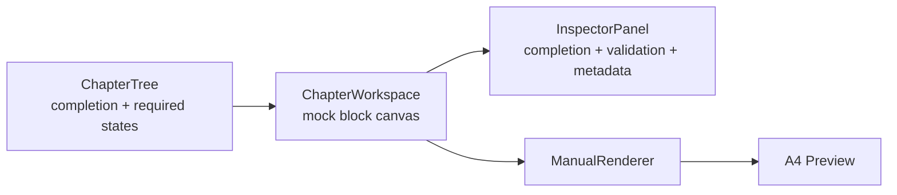

# Route and component map

## Route map

| Route | Purpose | Access | Phase |
|---|---|---|---|
| `/login` | Sign in; mocked role switcher in Phase 1 | Public | 1/2 |
| `/dashboard` | Portfolio status, completion and review queue summary | Member | 1 |
| `/ea-products` | EA product list | Developer/Admin | 1/2 |
| `/ea-products/[productId]` | Product identity and versions | Assigned member | 2 |
| `/manuals` | Filterable manual list | Member | 1 |
| `/manuals/new` | Existing/new EA wizard with reusable facts | Developer/Admin | 1/2 |
| `/manuals/[manualId]/edit` | Three-area builder | Assigned member/reviewer read mode | 1–6 |
| `/manuals/[manualId]/preview` | A4 preview using shared renderer | Assigned member/reviewer | 1/7 |
| `/manuals/[manualId]/reviews` | Review comments and history | Assigned member/reviewer | 6 |
| `/templates` | Manual/checklist templates | Admin; read for developers | 1/2 |
| `/reviews/technical` | Technical review queue | Technical reviewer/Admin | 1/6 |
| `/reviews/compliance` | Compliance review queue | Compliance reviewer/Admin | 1/6 |
| `/resources/guide` | Documentation guidance | Member | 1 |
| `/resources/compliance` | Checklist explanation; no approval claims | Member | 1/5 |
| `/settings` | Profile and organization settings | Member/Admin | 1/2 |
| `/manual/[eaSlug]/[version]` | Immutable published manual | Public only when published | 7 |

`/` redirects to `/dashboard` for an authenticated session and `/login` otherwise. Phase 1 uses mocked access but retains these URLs so later data/auth work does not rewrite navigation.

## Application shell

- `AppShell`: persistent desktop frame and mobile navigation coordination.
- `SidebarNav`: grouped, labeled Lucide navigation with active state.
- `WorkspaceHeader`: breadcrumbs, search slot, role identity, and one page-level primary action.
- `MobileNavDrawer`: navigation overlay below 1024px; focus trapped and dismissible by Escape.
- `PageHeader`: title, contextual status, supporting copy, and actions.

## Dashboard and lists

- `MetricStrip`: compact totals, avoiding oversized marketing cards.
- `ManualStatusTable`: sortable columns, responsive card rows below tablet width, row actions menu.
- `CompletionIndicator`: percentage plus label/icon so color is not the only signal.
- `StatusBadge`: status icon, text, semantic token.
- `FilterBar`, `TableEmptyState`, `TableSkeleton`, `Pagination`.

## Create manual wizard

- `ManualWizard`: route-level state with persisted mock draft in Phase 1.
- `WizardProgress`: named steps and completion state.
- `EASelectionStep`: existing EA selector or explicit create-new path.
- `ProductIdentityForm`: identity/version/platform/release/developer.
- `TechnicalRequirementsForm`: symbols, timeframes, trading requirements, dependencies.
- `SupportContactForm`: email/phone/WhatsApp/hours.
- `WizardReview`: fact summary and edit links.

Validation appears beside each labeled field, runs after blur/submit, and focuses a linked summary when multiple errors exist. Back/cancel routes do not discard state silently.

## Manual builder

- `BuilderShell`: desktop three-column grid; center has minimum width and owns primary scroll.
- `ChapterTree`: current/completed/incomplete/issue/required indicators and progress.
- `ChapterToolbar`: chapter title, edit/preview switch, save state.
- `MockBlockCanvas`: Phase 1 representation of text, step, image, callout, and parameter table blocks.
- `InspectorPanel`: tabs for completion, validation, and metadata; AI remains visibly unavailable until Phase 4.
- `ResponsivePanelControls`: chapter drawer and inspector sheet below desktop.
- `ManualRenderer`: semantic, read-only shared rendering contract.
- `A4Preview`: scaled paper view on screen and single-column readable preview on small screens.

## Shared interaction rules

- All visible actions work or are clearly disabled with a reason; no inert buttons.
- Drag and drop always has move-up/down and keyboard alternatives.
- Destructive actions require a confirmation and later provide recovery where feasible.
- Touch targets are at least 44px; visible focus rings meet contrast requirements.
- The builder avoids nested horizontal scrolling. On mobile, side panels become drawers/sheets and tables use deliberate responsive layouts.
- Animation is limited to state continuity at 120–200ms and respects reduced motion.
