# User Flows — Smartin Manual Builder

> Flows for the product established in `docs/ARCHITECTURE.md`, `docs/DATA_MODEL.md`, and `docs/ROUTES_AND_COMPONENTS.md`. Phase annotations use `docs/IMPLEMENTATION_PLAN.md`. Where a step is mocked in Phase 1 it is marked *(mock)*.
> Terminology: **EA Product** → **EA Version** → **Manual** → **Manual Version** → **Chapters (sections)** → **Blocks**. Workflow states: `DRAFT`, `TECHNICAL_REVIEW`, `COMPLIANCE_REVIEW`, `CHANGES_REQUESTED`, `APPROVED`, `PUBLISHED`, `ARCHIVED`.

---

## 0. Actors and entry points

| Actor | Entry | Home |
|---|---|---|
| Developer / contributor | `/login` → `/dashboard` | Dashboard, EA Products, Manuals, Builder |
| Technical reviewer | `/login` → `/dashboard` | `/reviews/technical` |
| Compliance reviewer | `/login` → `/dashboard` | `/reviews/compliance` |
| Admin | `/login` → `/dashboard` | Templates, Reviews, publish actions |
| Public reader (Phase 7) | `/manual/[eaSlug]/[version]` | The published manual |

`/` redirects to `/dashboard` when authenticated, `/login` otherwise. Phase 1 auth is a mocked role select; Phase 2 is Supabase Auth (`PRD-PLT-001`).

---

## 1. End-to-end developer journey (happy path)

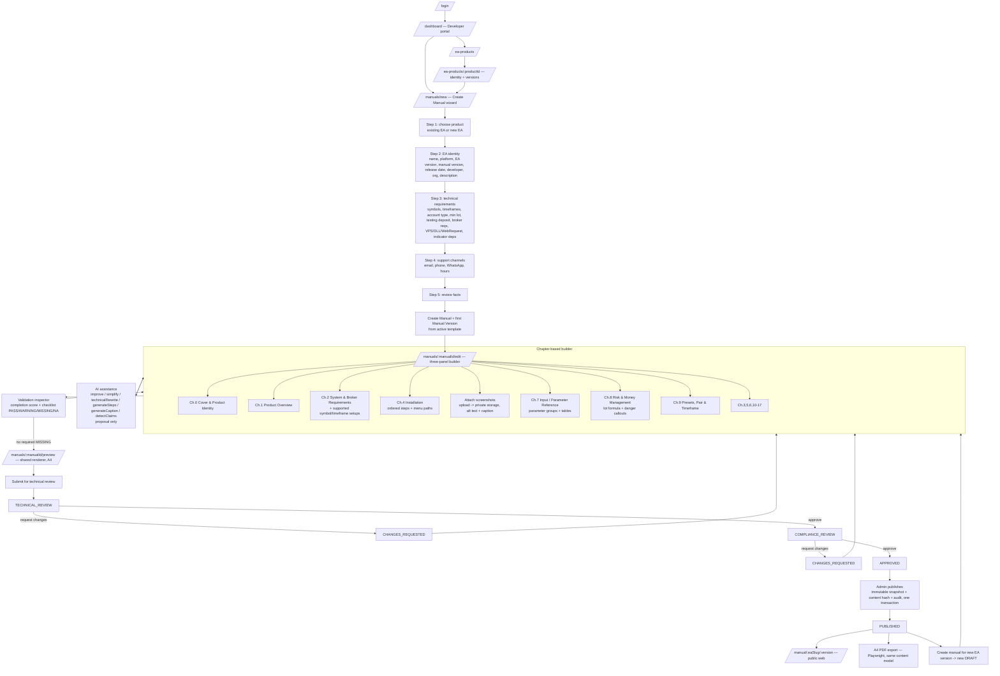

Phase reality: builder chapters, mock blocks, preview, disabled AI/submit exist in Phase 1. Real create/edit/save = Phase 2. Editable blocks/steps/parameters = Phase 3. AI = Phase 4. Validation engine = Phase 5. Review transitions + publish + version clone = Phase 6. Public web + PDF = Phase 7.

---

## 2. Authentication

### 2.1 Sign in (Phase 1 mock → Phase 2 real)

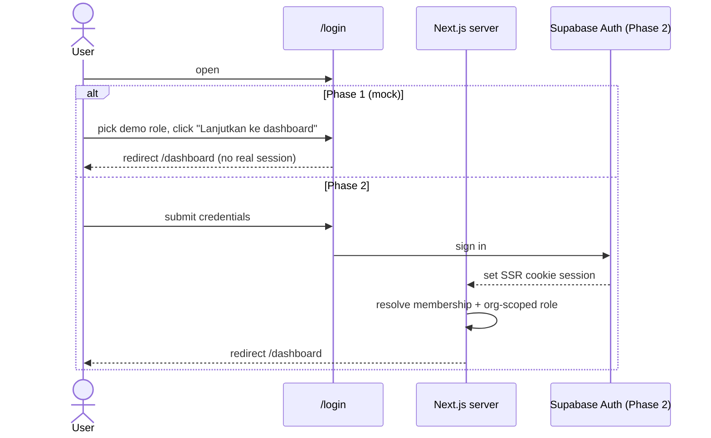

- Phase 2: no membership → user sees an "ask an admin to add you to an organisation" state, not the workspace.
- Sign out clears the cookie session and returns to `/login`.

---

## 3. EA Product and EA Version flows

### 3.1 Create a new EA Product (`PRD-EA-001`)

1. Developer/Admin opens `/ea-products` → **Add product** (or picks "create new EA" in the wizard, §5.2).
2. Enters name, description; slug is derived and checked unique per organisation.
3. Server creates `ea_products` with `organization_id` + `owner`.
4. Redirect to `/ea-products/[productId]` with an empty version list and a **Create EA version** action.

Errors: duplicate slug → inline error on name; not permitted → action blocked with reason.

### 3.2 Use an existing EA Product

1. `/ea-products` list → open a product → `/ea-products/[productId]`.
2. Choose an existing EA Version, or **Create EA version**.
3. From the product or version, **Create manual** launches the wizard pre-scoped to that product (§5.1).

### 3.3 Create a new EA Version (`PRD-EA-003`, `PRD-EA-004`, `PRD-EA-006`)

```mermaid
flowchart TD
    A[/ea-products/:productId/] --> B[Create EA version]
    B --> C[Enter semver + platform MT4/MT5 + release date]
    C --> D{version+platform unique for product?}
    D -- no --> C
    D -- yes --> E[Enter structured requirements\nsymbols, timeframes, account type, min lot,\ntesting deposit, broker reqs, VPS/DLL/WebRequest,\ncustom indicator dependencies]
    E --> F[Add supported symbol/timeframe setups\nlist of {symbol, timeframe, note}]
    F --> G[Enter support details\nemail, phone, WhatsApp, hours]
    G --> H[Optionally copy parameter list from a prior version]
    H --> I[Save ea_versions row]
    I --> J[Version appears under product; ready to document]
```

- Nothing version-specific is auto-filled from another version unless the user explicitly copies (`PRD-EA-007`).
- Supported setups are discrete records so an EA version can support e.g. `XAUUSD @ M15` **and** `XAUUSD @ H1` (`PRD-SUCC-008`).

---

## 4. Create Manual (wizard) flows

### 4.1 Create manual for an existing EA (`PRD-MAN-004`)

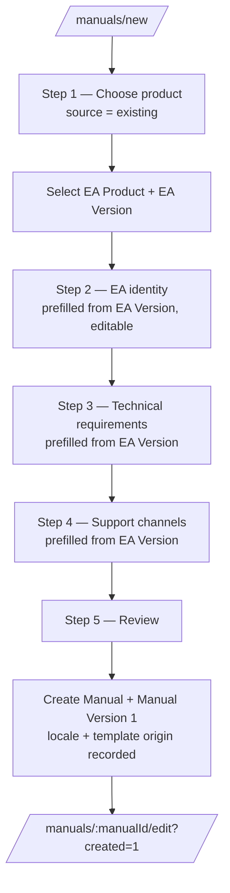

- Each step validates its own fields on blur/submit (Zod). Multiple errors focus a linked error summary.
- Draft autosaves locally *(mock: `localStorage`)* / server-side (Phase 2).
- Back/cancel keep state; cancel confirms before leaving.

### 4.2 Create manual with a new EA (`source = new`)

Same wizard; Step 1 = "create new EA". Step 2 identity fields are empty and required. On create, the server first creates `ea_products` + `ea_versions`, then the Manual + Manual Version (`PRD-EA-001`, `PRD-EA-003`). If EA creation fails, no manual is created (atomic).

### 4.3 Create a new **Manual Version** after publication (`PRD-MAN-013`)

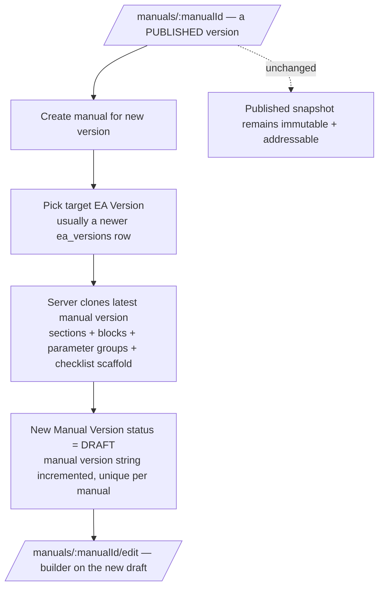

---

## 5. Manual builder flows (`/manuals/[manualId]/edit`)

### 5.1 Open the builder and navigate chapters

1. Open `/manuals/[manualId]/edit`. Server loads the `ManualViewModel` for **that** manual id (`PRD-MAN-014`). Phase 1 renders the VMax sample regardless — a known mock shortcut to be removed in Phase 2.
2. LEFT `ChapterTree`: chapters with state (complete / current / incomplete / issue), required lock icon, overall progress.
3. Select a chapter → CENTER editor shows that chapter's blocks; RIGHT inspector updates. Selection persists (mock: `localStorage`; Phase 2: server/URL).
4. Below 1024px, chapters and inspector are drawers; the editor stays primary.

### 5.2 Fill structured information (Chapters 0–2)

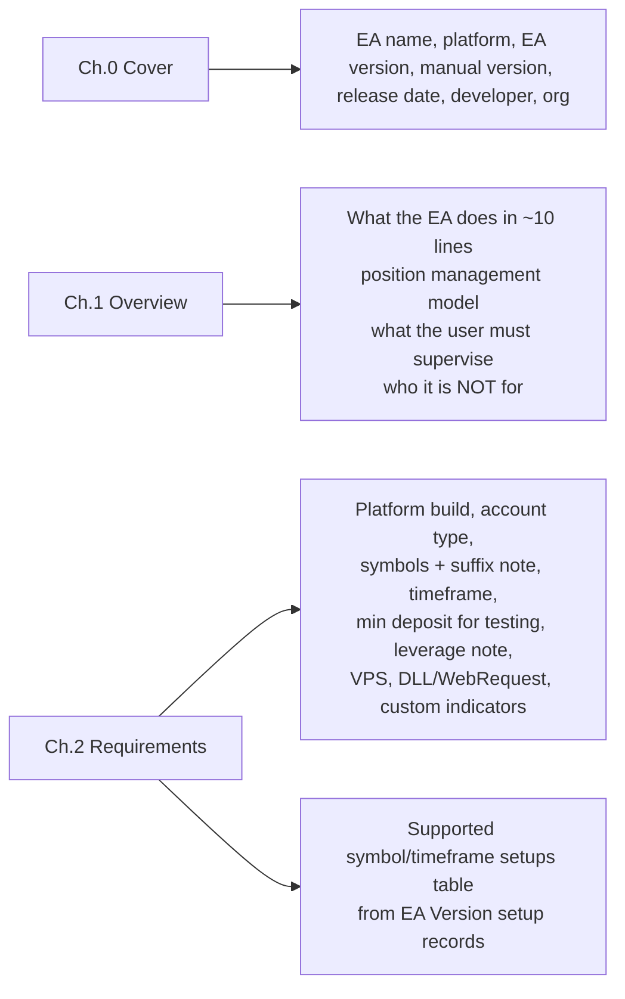

- Cover/identity fields are backed by the EA Version; editing them here is guarded (may require editing the EA Version, per Open question `PRD-OQ-006`).

### 5.3 Installation authoring (Chapter 4) (`PRD-CNT-002`)

1. In Chapter 4, add a **steps** block (Phase 3; Phase 1 shows a mock step list).
2. Add ordered steps: each has title, instruction, optional menu path (e.g. `File → Open Data Folder`), optional image reference.
3. Reorder with drag or up/down buttons or keyboard (`PRD-MAN-008`).
4. Add a `callout` (warning) for "use a demo account first / EA is an aid, results not guaranteed".

### 5.4 Screenshot / documentation workflow (`PRD-CNT-003`–`005`)

```mermaid
sequenceDiagram
    actor Dev as Developer
    participant B as Builder (image block)
    participant S as Next.js server
    participant St as Private Supabase Storage
    Dev->>B: Add image block -> Upload file
    B->>S: request signed upload
    S->>St: create private object (org-scoped key)
    S->>S: insert image_assets (mime, dimensions, scan_status=pending)
    S-->>B: asset id + signed read URL
    Dev->>B: enter alt text (required) + caption
    B->>S: save block { type:image, imageAssetId, caption }
    Note over S,St: image stays private until publish;<br/>served via short-lived signed URLs
    Note over Dev: guidance shown: mask account no., balance, broker name
```

- A chapter with an image cannot be marked complete until alt text is present and `scan_status` is acceptable (Phase 5 gate; Open question `PRD-OQ-009`).

### 5.5 Edit a parameter (`PRD-CNT-006`, `PRD-CNT-007`)

```mermaid
flowchart TD
    A[Ch.7 Input / Parameter Reference] --> B[Add/select a parameter group\nname + position]
    B --> C[Add EA parameter]
    C --> D[Fields: display name, technical name, type\n(bool/int/double/string/enum/color),\ndefault, unit, safe range, options,\ndescription, order effect,\nmutability (before start / live / re-attach),\nnotes, required]
    D --> E[Save ea_parameters row (validated)]
    E --> F[parameterTable block references group id(s)]
    F --> G[Renderer shows group heading + columns\nParameter | Type | Default | Safe range | Effect]
    G --> H[Validation: every EA input present? units defined?]
```

- Editing an existing parameter updates the normalised record; every `parameterTable` referencing its group reflects the change (no copy-paste drift).

### 5.6 Risk documentation (Chapter 8) (`PRD-CNT-009`)

1. Author the verbal lot formula (e.g. "lot = equity × RiskPercent / 100 ÷ loss-if-SL-hit"), floor/step lot, below-min-lot behaviour.
2. If the EA has martingale / unbounded grid / recovery: a `callout` warning is placed at the **top** of the chapter, not a footnote.
3. Validation warns if a dangerous mode is declared on the EA Version but no warning callout exists.

### 5.7 AI assistance (Phase 4) (`PRD-AI-*`)

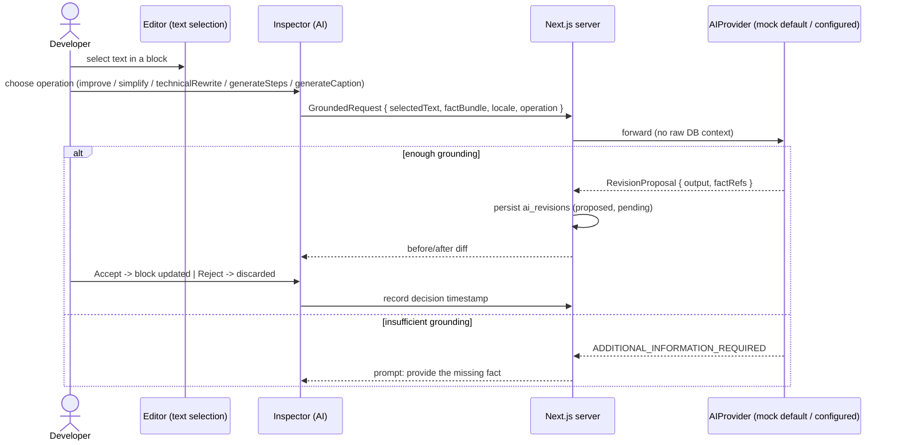

- `detectClaims` runs over a chapter or the whole manual and returns `ClaimFinding[]`; findings are advisory, shown to the developer and later to the compliance reviewer. Never auto-edits.
- Until Phase 4, the AI panel is visibly disabled ("available in Phase 4").

### 5.8 Validation (Phase 5) (`PRD-VAL-*`)

1. Inspector → **Validasi** tab shows the completion score and per-check results.
2. Checklist results are `PASS` / `WARNING` / `MISSING` / `NOT_APPLICABLE`, each with evidence (a link to the chapter/block/field).
3. Fixing content re-evaluates the affected checks.
4. Submit is blocked while any **required** chapter has a `MISSING` result (`PRD-VAL-005`); `WARNING` does not block.

### 5.9 Save draft (`PRD-MAN-012`)

```mermaid
flowchart TD
    A[Developer edits a block/field] --> B[Debounced autosave ~1s]
    B --> C{server version token matches?}
    C -- yes --> D[Persist; update updated_at + token; show "Saved"]
    C -- no (concurrent edit) --> E[Show conflict notice\noffer reload / keep-mine, do not silently overwrite]
```

Phase 1: save state is a static "Tersimpan barusan" indicator; wizard/builder selection persist in `localStorage`.

### 5.10 Preview (`PRD-OUT-007`)

1. Builder → **Preview manual** → `/manuals/[manualId]/preview`.
2. Same `ManualRenderer` as the builder canvas; A4 proportions on screen, single-column on small screens.
3. "Export PDF" is present but disabled with "available in Phase 7".
4. "Edit manual" returns to the builder for the same manual id.

---

## 6. Review flows (Phase 6) (`PRD-REV-*`)

### 6.1 Submit for review

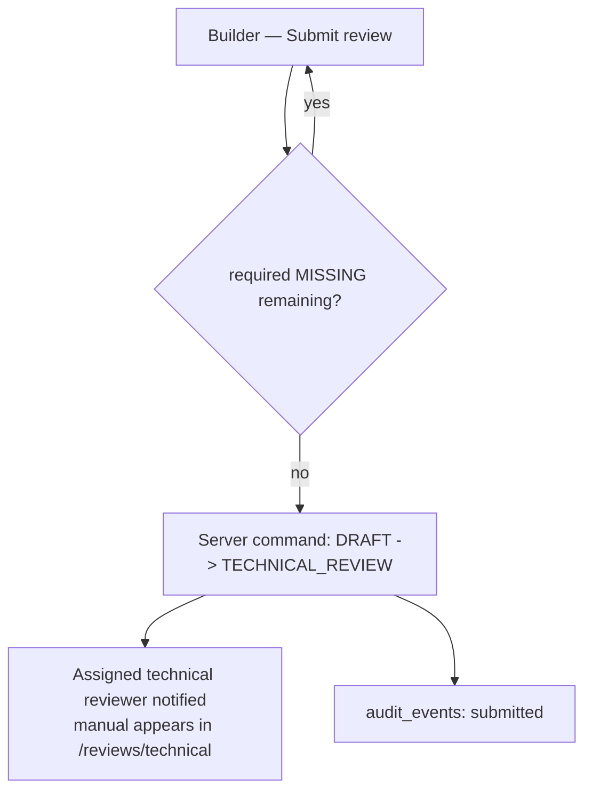

### 6.2 Technical review decision

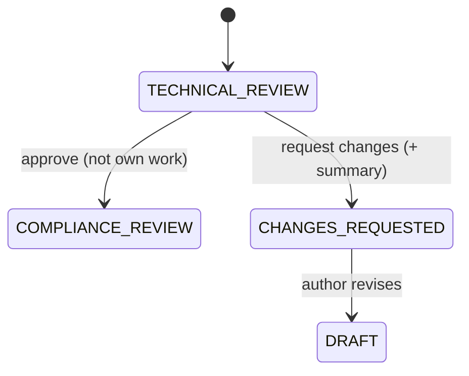

1. Reviewer opens the manual in read/comment mode (`/manuals/[manualId]/edit` read mode + `/manuals/[manualId]/reviews`).
2. Adds comments anchored to a section, a block, or the manual generally.
3. Chooses **Approve** (→ `COMPLIANCE_REVIEW`) or **Request changes** (→ `CHANGES_REQUESTED`) with a summary.
4. Guard: cannot approve if the reviewer authored/edited this manual version (`PRD-REV-006`).
5. `audit_events` records the decision + actor + timestamp.

### 6.3 Compliance review decision

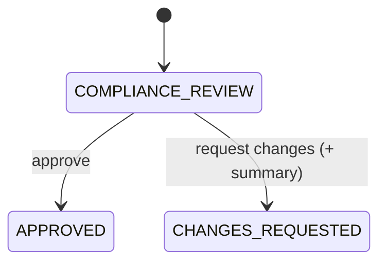

1. Manual appears in `/reviews/compliance` **only after** technical approval.
2. Reviewer sees the documentation checklist (PASS/WARNING/MISSING/NA) + claim-scan findings.
3. Chooses **Approve** (→ `APPROVED`) or **Request changes** (→ `CHANGES_REQUESTED`).
4. UI wording: "documentation checklist completed" / "ready for compliance review" — never "regulator approved".

### 6.4 Changes requested → resubmit

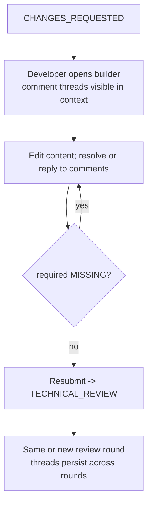

- A resubmission always re-enters technical review (compliance cannot be reached without a fresh technical approval).

---

## 7. Publication and versioning flows

### 7.1 Publish (`PRD-OUT-002`, `PRD-REV`)

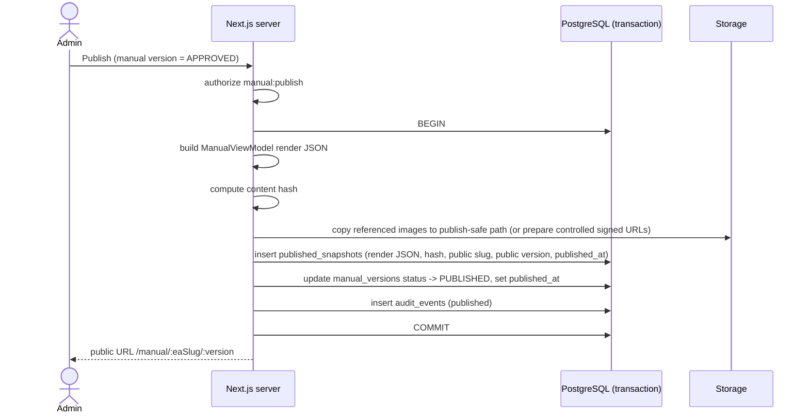

- If any step fails, the transaction rolls back — no partial publish.
- After `PUBLISHED`, update/delete triggers reject edits except controlled archive metadata (`PRD-OUT-003`).

### 7.2 Public web output (Phase 7) (`PRD-OUT-004`)

1. Reader opens `/manual/[eaSlug]/[version]`.
2. Server serves the immutable snapshot: cover, chapters, blocks, parameter tables, images (publish-safe), table of contents, in-page search, version switcher.
3. No draft, no private working data, no auth required.

### 7.3 PDF output (Phase 7) (`PRD-OUT-005`, `PRD-POUT-*`)

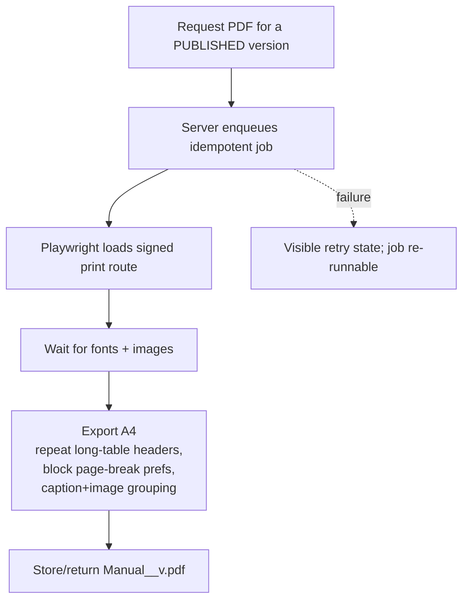

### 7.4 Create a new version after publication

See §4.3 — the published version is untouched; a new `DRAFT` Manual Version is cloned and re-enters the builder → review → publish cycle.

### 7.5 Archive

`PUBLISHED → ARCHIVED` removes a version from default public listings while keeping it addressable. Archive is an admin action, audited, and only touches controlled archive metadata (not the snapshot).

---

## 8. Cross-cutting flows

### 8.1 Upload image (standalone reference)

Covered in §5.4. Key invariants: org-scoped private key, `image_assets` record, alt text required for completion, `scan_status` gate, publish-safe handling on publish, never public while unpublished.

### 8.2 Edit parameter (standalone reference)

Covered in §5.5. Key invariant: normalised `ea_parameters`; edits propagate to every `parameterTable` block referencing the group; the version-parameter completeness check compares the parameter set to the EA Version's declared inputs.

### 8.3 Template management (Admin, Phase 2/5)

```mermaid
flowchart TD
    A[/templates/] --> B[Manual template — versioned\nchapter list, required flags, help text]
    A --> C[Checklist template — versioned\nitems, categories, evaluation-rule keys]
    B --> D[New manual versions instantiate the active template version\n(recorded on the manual version)]
    C --> E[Checklist engine evaluates against the active checklist template version\n(recorded on each checklist_result set)]
```

### 8.4 Permission-denied flow (any action)

Any action the current role/actor may not perform is either **not rendered**, or rendered **disabled with a visible reason** (no inert buttons). Server rejects with a typed workflow/permission error; the UI surfaces it near the trigger.

### 8.5 Organisation isolation (implicit in every flow)

Every list, read, and mutation is scoped by `organization_id` via server checks and RLS. A user with membership in Org A never sees Org B's EA products, manuals, images, reviews, or audit events.
